# Week 1: RISC-V Bare-Metal Toolchain & Debugging

This document outlines the tasks completed in **Week 1** of the RISC-V SoC Lab, focusing on installing the RISC-V bare-metal toolchain and verifying the functionality of key tools (`gcc`, `objdump`, `gdb`).

---

##  Task 1:

Install the RISC-V toolchain and verify that it is working properly.

---

## ✅ Steps Followed

### 1. Download the Toolchain

Downloaded from the official VSD-Labs link:  
https://vsd-labs.sgp1.cdn.digitaloceanspaces.com/vsd-labs/riscv-toolchain-rv32imac-x86_64-ubuntu.tar.gz

### 2. Extract the Toolchain

Extracted the tarball using:

sudo tar -xvzf riscv-toolchain-rv32imac-x86_64-ubuntu.tar.gz -C /opt/

This created a folder named:

riscv-toolchain-rv32imac

### 3. Add to PATH (Temporarily)

Added the toolchain’s bin folder to the system PATH for the current session:

echo 'export PATH=$PATH:/opt/riscv-toolchain/bin' >> ~/.bashrc

### 4. Verify the Installation

Checked the installed tools by verifying their versions:

riscv32-unknown-elf-gcc --version
riscv32-unknown-elf-objdump --version
riscv32-unknown-elf-gdb --version

## OUTPUT:

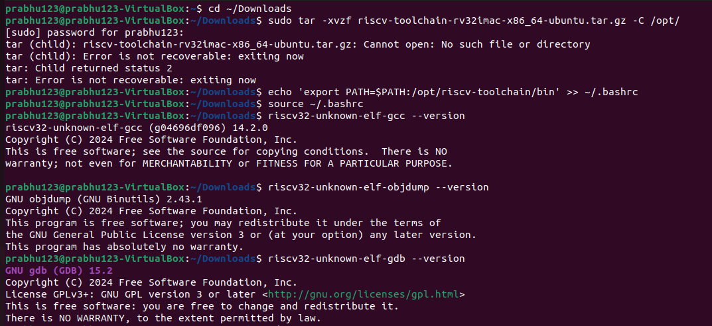  


# Task 2: Cross-Compile "Hello, RISC-V"

Create a minimal C "Hello World" program and successfully cross-compile it for the RISC-V RV32 architecture, producing a
 valid 32-bit RISC-V ELF executable that demonstrates proper toolchain functionality


---

## ✅ Steps Followed


### 1: Create the Hello World C Program:


Create a minimal C program that demonstrates basic functionality and printf usage.

nano hello.c

**C Program Code:**

#include <stdio.h>

int main() {
printf("Hello, RISC-V!\n");
return 0;
}


### 2: Cross-Compile for RISC-V Architecture

Compile the C program using the RISC-V toolchain with the default configuration that works with your specific toolchain setup.

 Cross-compile using default toolchain configuration (THIS WORKS!)

riscv32-unknown-elf-gcc -o hello.elf hello.c

###  3: Verify the Compiled ELF Binary

Check that the compiled binary is a valid 32-bit RISC-V executable.

###  Check the ELF file properties and architecture

file hello.elf

Output:


hello.elf: ELF 32-bit LSB executable, UCB RISC-V, RVC, soft-float ABI, version 1 (SYSV), statically linked, not stripped

###  4: Additional Working Verification Commands

 riscv32-unknown-elf-objdump -h hello.elf


# output:

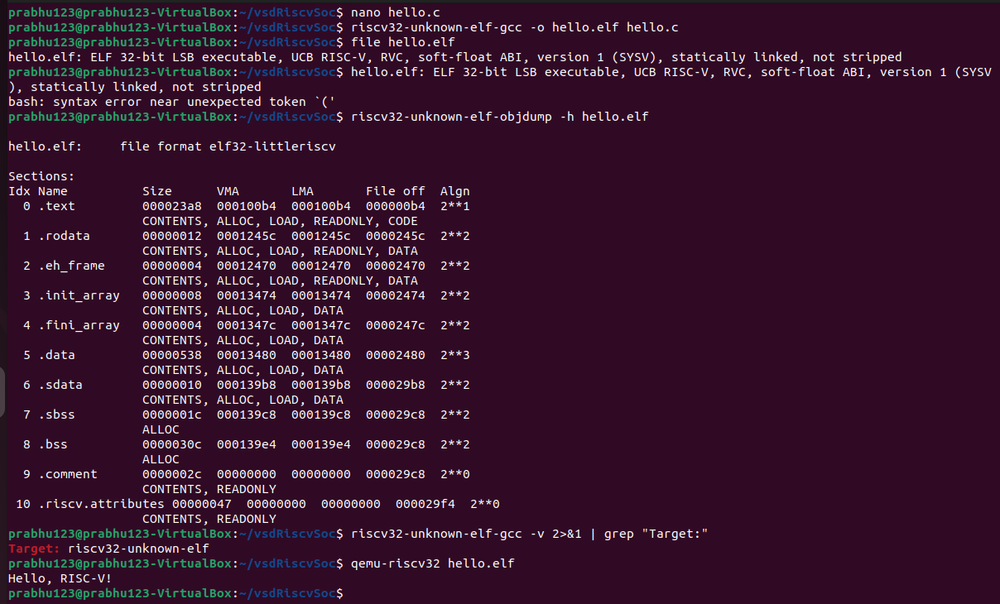  

# Task 3: From C to Assembly - Generate and Analyze Assembly Code

Generate assembly code from the C "Hello, RISC-V" program and perform detailed analysis of the function prologue and epilogue
 to understand RISC-V calling conventions, stack frame management, and instruction encoding patterns.

## ✅ Steps Followed

### 1:Generate assembly code from the C file (hello.c):

use the riscv32-unknown-elf-gcc compiler with specific flags to prevent optimizations and disable position-independent 
code (for clarity):

riscv32-unknown-elf-gcc -S -O0 -fno-pic -march=rv32imc -mabi=ilp32 hello.c -o hello.s

### 2:Verify that the generated file is an ASCII text assembly source:

Use the file command to confirm that the output is an ASCII assembly source file:

file hello.s

### 3:View the first 20 lines of the assembly code:

head -20 hello.s
 
### 4:View the full hello.s file with line numbers using nl and less:

nl -ba hello.s | less

This command displays the entire assembly file with line numbers, which helps in analyzing instruction sequences and structure.
## OUTPUT:

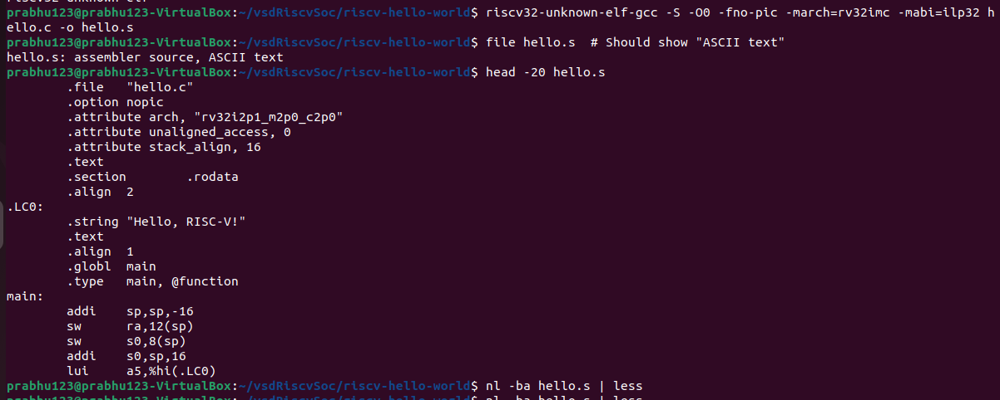

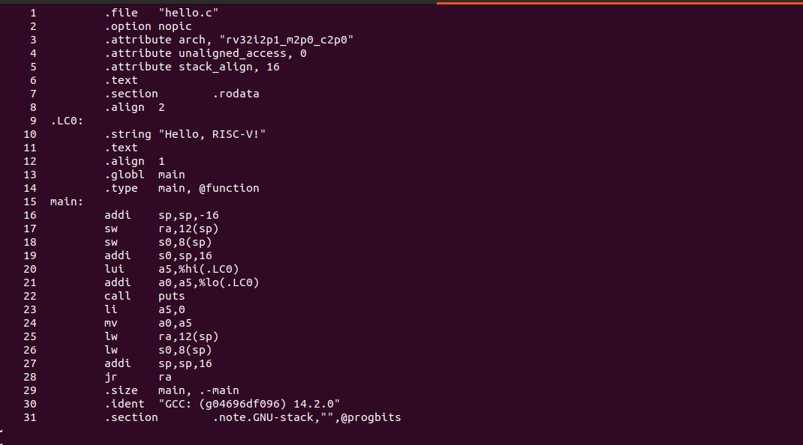


# Task 4: Hex Dump & Disassembly Analysis

Convert the compiled RISC-V ELF binary to Intel HEX format for hardware deployment and perform detailed disassembly analysis to understand machine code structure, instruction encoding,
 and memory layout of the cross-compiled program.[1]

## ✅ Steps Followed

### Step 1: Generate Complete Disassembly

Create a detailed disassembly of the ELF binary to examine machine code and instruction encoding.
Generate comprehensive disassembly and save to file
```bash
riscv32-unknown-elf-objdump -d hello.elf > hello.dump
```
Verify disassembly file was created
```bash
ls -la hello.dump
```
View the complete disassembly output
```bash
cat hello.dump
```

### Step 2: Convert ELF to Intel HEX Format

Generate Intel HEX format suitable for programming embedded systems and hardware simulators.
Convert ELF binary to Intel HEX format
```bash
riscv32-unknown-elf-objcopy -O ihex hello.elf hello.hex
```
Verify HEX file creation
```bash
ls -la hello.hex
```
View the Intel HEX output
```bash
cat hello.hex
```

### Step 3: Analyze Main Function Disassembly

Focus on the main function to understand the column structure and instruction encoding.

Extract main function disassembly for detailed analysis
```bash
grep -A 20 "<main>:" hello.dump
```

View disassembly with context around main function


grep -B 5 -A 20 "<main>:" hello.dump

## OUTPUT:

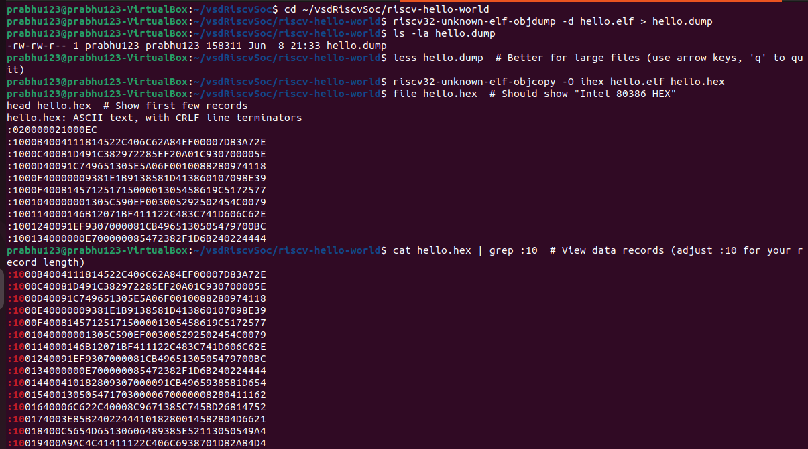

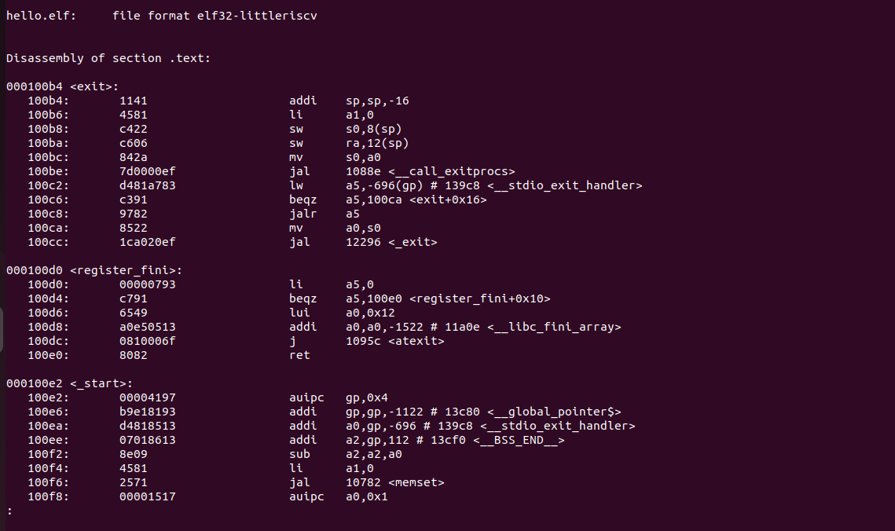

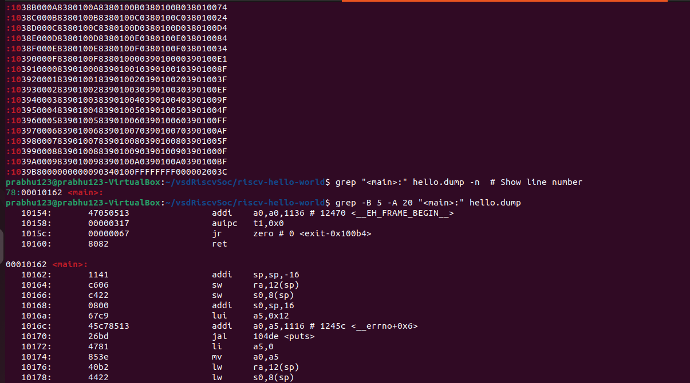

# 📚 Task 5: RISC-V ABI & Register Cheat-Sheet:

Create a comprehensive RISC-V Application Binary Interface (ABI) reference guide that maps all 32 integer registers to their ABI names
 and documents the complete calling convention rules for function arguments, return values, and register preservation requirements.

### Step 1: Create Register Reference Section
markdown

## 📋 RISC-V Register Reference

| Register | ABI Name | Preserved | Purpose                          |
|----------|----------|-----------|----------------------------------|
| x0       | zero     | Immutable | Hard-wired zero                  |
| x1       | ra       | Caller    | Return address                   |
| x2       | sp       | Callee    | Stack pointer (16-byte aligned)  |
| x3       | gp       | -         | Global pointer                   |
| [...]    | [...]    | [...]     | [...]                            |
| x31      | t6       | Caller    | Temporary register 6             |

### Step 2: Add Calling Convention Rules
markdown

## 📜 Calling Convention

*Argument Passing:*
- First 8 arguments: a0-a7 (x10-x17)
- Additional arguments: Stack (right-to-left)
- Return values: a0-a1

*Preservation Rules:*
| Category       | Registers       | Responsibility |
|---------------|----------------|----------------|
| Callee-saved  | sp, s0-s11     | Must preserve  |
| Caller-saved  | ra, t0-t6, a0-a7 | May clobber   |

### Step 3: Add Verification Checklist
markdown

## 🔍 ABI Compliance Checklist

bash
# Verify function prologue/epilogue
grep -A 5 "main:" hello.s | grep -E "sp|ra|s0"

# Check system call arguments
grep "ecall" hello.s -B 1 | grep "a[0-7]"

# Examine stack operations
grep "sp" hello.s | grep -v "addi"

Key Requirements:

    16-byte stack alignment maintained

    ra saved for non-leaf functions

    s-registers preserved if modified

    Arguments properly passed in a0-a7

text


### Step 4: Add Quick Reference Examples
markdown
## ⚡ Quick Reference

*Function Prologue:*
assembly
addi sp, sp, -16    # Allocate stack
sw ra, 12(sp)       # Save return address
sw s0, 8(sp)        # Save frame pointer

Function Epilogue:
assembly

lw s0, 8(sp)        # Restore frame pointer
lw ra, 12(sp)       # Restore return address
addi sp, sp, 16     # Deallocate stack
ret

System Call Example:
assembly

li a7, 64           # write syscall number
li a0, 1            # stdout
la a1, message      # buffer address
li a2, 12           # message length
ecall

text


### Step 5: Add Complete Usage Section
markdown
## 🛠️ Complete Usage Guide

1. *Register Types:*
   - *Temporaries (t0-t6):* Caller-saved, for short-lived values
   - *Saved (s0-s11):* Callee-saved, for long-lived values
   - *Arguments (a0-a7):* Function parameters/return values

2. *Stack Rules:*
   - Always keep sp 16-byte aligned
   - Grow downward (higher to lower addresses)
   - Save registers to stack before modification

3. *Common Patterns:*
   assembly
   # Save multiple registers
   addi sp, sp, -32
   sw ra, 28(sp)
   sw s0, 24(sp)
   sw s1, 20(sp)

text


### Step 6: Add Visual Reference (Optional)
markdown
## 🖼️ Register Map Visualization

Special Purpose:
┌─────┬─────┬────────────────────┐
│ x0 │ zero│ Hard-wired 0 │
│ x1 │ ra │ Return Address │
│ x2 │ sp │ Stack Pointer │
└─────┴─────┴────────────────────┘

Argument Registers:
┌─────┬─────┬────────────────────┐
│ x10 │ a0 │ Arg 0 / Return 0 │
│ ... │ ... │ ... │
│ x17 │ a7 │ Arg 7 / Syscall # │
└─────┴─────┴────────────────────┘
text

### Final Step: Add Verification Commands
markdown

## ✅ Verification


# Check stack alignment:
grep "addi.*sp" hello.s | grep -E "16|32|48|64"

# Verify register saves/restores:
grep -E "sw|lw" hello.s | grep -E "ra|s[0-9]"

# Count ecall arguments:
grep -B1 "ecall" hello.s | grep -o "a[0-7]" | sort | uniq -c

## OUTPUT:

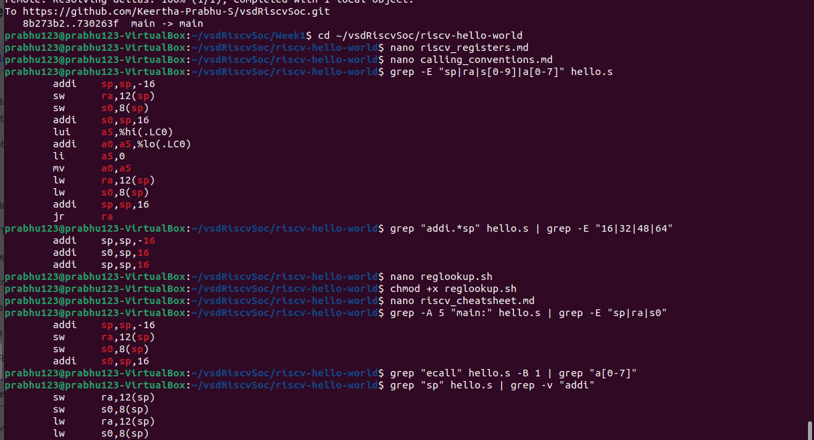

# 🔍 Task 6: Stepping with GDB - RISC-V Debugging

Use RISC-V GDB to debug the cross-compiled `hello.elf` binary, set breakpoints at main function, step through execution, and
 inspect register contents and assembly instructions to understand program flow at the machine code level.

## OUTPUT:

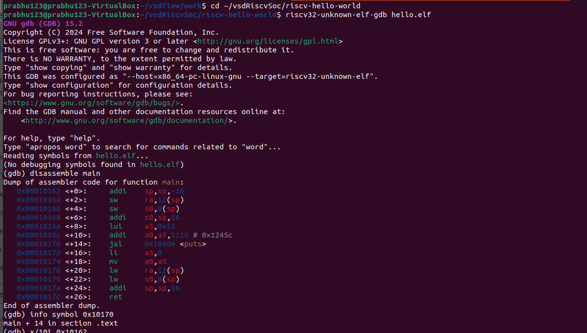

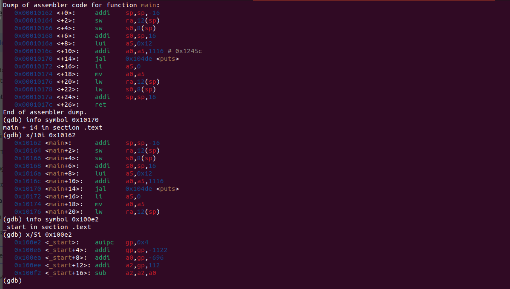

# 🖥️ Task 7: Running Under an Emulator - RISC-V QEMU Emulation

Run the bare-metal RISC-V ELF binary under an emulator (QEMU or Spike) to simulate hardware execution and demonstrate UART console
 output, verifying that cross-compiled programs can execute properly in a virtual RISC-V environment.

## OUTPUT:
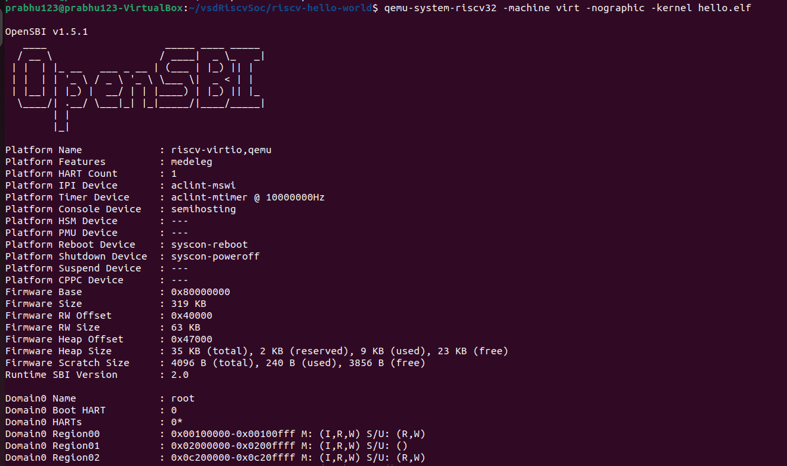
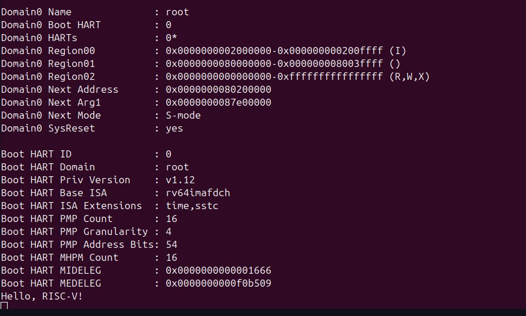
