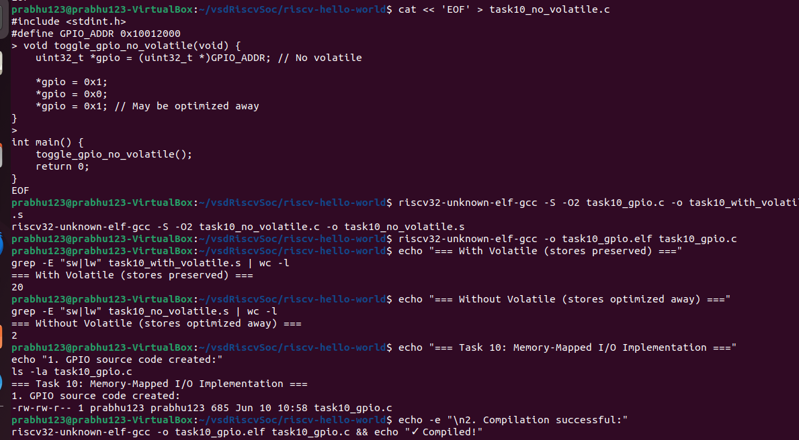
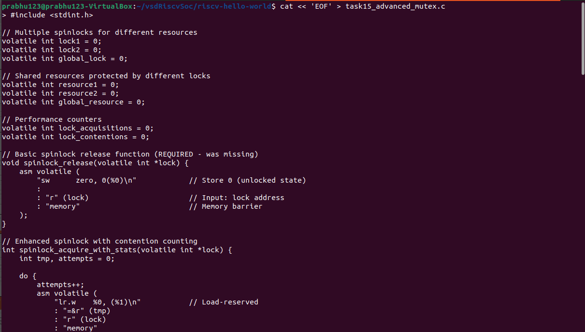
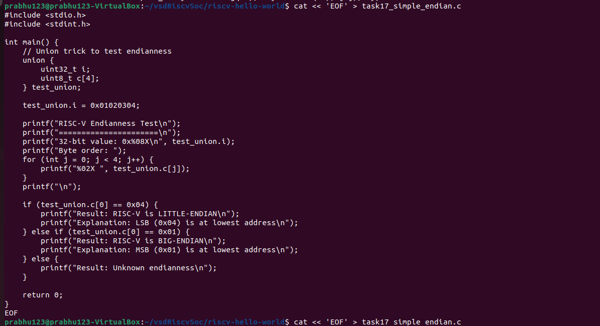

# Week 1: RISC-V Bare-Metal Toolchain & Debugging

This document outlines the tasks completed in **Week 1** of the RISC-V SoC Lab, focusing on installing the RISC-V bare-metal toolchain and verifying the functionality of key tools (`gcc`, `objdump`, `gdb`).

---

##  Task 1:

Install the RISC-V toolchain and verify that it is working properly.

---

## ✅ Steps Followed

### 1. Download the Toolchain

Downloaded from the official VSD-Labs link:  
https://vsd-labs.sgp1.cdn.digitaloceanspaces.com/vsd-labs/riscv-toolchain-rv32imac-x86_64-ubuntu.tar.gz

### 2. Extract the Toolchain

Extracted the tarball using:

sudo tar -xvzf riscv-toolchain-rv32imac-x86_64-ubuntu.tar.gz -C /opt/

This created a folder named:

riscv-toolchain-rv32imac

### 3. Add to PATH (Temporarily)

Added the toolchain’s bin folder to the system PATH for the current session:

echo 'export PATH=$PATH:/opt/riscv-toolchain/bin' >> ~/.bashrc

### 4. Verify the Installation

Checked the installed tools by verifying their versions:

riscv32-unknown-elf-gcc --version
riscv32-unknown-elf-objdump --version
riscv32-unknown-elf-gdb --version

## OUTPUT:

  


# Task 2: Cross-Compile "Hello, RISC-V"

Create a minimal C "Hello World" program and successfully cross-compile it for the RISC-V RV32 architecture, producing a
 valid 32-bit RISC-V ELF executable that demonstrates proper toolchain functionality


---

## ✅ Steps Followed


### 1: Create the Hello World C Program:


Create a minimal C program that demonstrates basic functionality and printf usage.

nano hello.c

**C Program Code:**

#include <stdio.h>

int main() {
printf("Hello, RISC-V!\n");
return 0;
}


### 2: Cross-Compile for RISC-V Architecture

Compile the C program using the RISC-V toolchain with the default configuration that works with your specific toolchain setup.

 Cross-compile using default toolchain configuration (THIS WORKS!)

riscv32-unknown-elf-gcc -o hello.elf hello.c

###  3: Verify the Compiled ELF Binary

Check that the compiled binary is a valid 32-bit RISC-V executable.

###  Check the ELF file properties and architecture

file hello.elf

Output:


hello.elf: ELF 32-bit LSB executable, UCB RISC-V, RVC, soft-float ABI, version 1 (SYSV), statically linked, not stripped

###  4: Additional Working Verification Commands

 riscv32-unknown-elf-objdump -h hello.elf


# output:

  

# Task 3: From C to Assembly - Generate and Analyze Assembly Code

Generate assembly code from the C "Hello, RISC-V" program and perform detailed analysis of the function prologue and epilogue
 to understand RISC-V calling conventions, stack frame management, and instruction encoding patterns.

## ✅ Steps Followed

### 1:Generate assembly code from the C file (hello.c):

use the riscv32-unknown-elf-gcc compiler with specific flags to prevent optimizations and disable position-independent 
code (for clarity):

riscv32-unknown-elf-gcc -S -O0 -fno-pic -march=rv32imc -mabi=ilp32 hello.c -o hello.s

### 2:Verify that the generated file is an ASCII text assembly source:

Use the file command to confirm that the output is an ASCII assembly source file:

file hello.s

### 3:View the first 20 lines of the assembly code:

head -20 hello.s
 
### 4:View the full hello.s file with line numbers using nl and less:

nl -ba hello.s | less

This command displays the entire assembly file with line numbers, which helps in analyzing instruction sequences and structure.
## OUTPUT:


# Task 4: Hex Dump & Disassembly Analysis

Convert the compiled RISC-V ELF binary to Intel HEX format for hardware deployment and perform detailed disassembly analysis to understand machine code structure, instruction encoding,
 and memory layout of the cross-compiled program.[1]

## ✅ Steps Followed

### Step 1: Generate Complete Disassembly

Create a detailed disassembly of the ELF binary to examine machine code and instruction encoding.
Generate comprehensive disassembly and save to file
```bash
riscv32-unknown-elf-objdump -d hello.elf > hello.dump
```
Verify disassembly file was created
```bash
ls -la hello.dump
```
View the complete disassembly output
```bash
cat hello.dump
```

### Step 2: Convert ELF to Intel HEX Format

Generate Intel HEX format suitable for programming embedded systems and hardware simulators.
Convert ELF binary to Intel HEX format
```bash
riscv32-unknown-elf-objcopy -O ihex hello.elf hello.hex
```
Verify HEX file creation
```bash
ls -la hello.hex
```
View the Intel HEX output
```bash
cat hello.hex
```

### Step 3: Analyze Main Function Disassembly

Focus on the main function to understand the column structure and instruction encoding.

Extract main function disassembly for detailed analysis
```bash
grep -A 20 "<main>:" hello.dump
```

View disassembly with context around main function


grep -B 5 -A 20 "<main>:" hello.dump

## OUTPUT:


# 📚 Task 5: RISC-V ABI & Register Cheat-Sheet:

Create a comprehensive RISC-V Application Binary Interface (ABI) reference guide that maps all 32 integer registers to their ABI names
 and documents the complete calling convention rules for function arguments, return values, and register preservation requirements.

## ✅ Steps Followed

### Step 1: Create Register Reference Section
Create a markdown table documenting all 32 RISC-V integer registers with their ABI names and calling conventions.

Create register reference table
```bash
nano risc_v_register_table.md
```

**Complete Register Mapping Table:**


## 📋 Complete RISC-V Integer Register Reference

| Register | ABI Name | Type | Calling Convention | Preserved Across Calls | Description |
|----------|----------|------|-------------------|------------------------|-------------|
| **x0** | `zero` | Special | Hard-wired zero | — (Immutable) | Always contains 0, writes ignored |
| **x1** | `ra` | Link | Caller-saved | No | Return address |
| **x2** | `sp` | Pointer | Callee-saved | Yes | Stack pointer (16-byte aligned) |
| **x3** | `gp` | Pointer | Unallocatable | — | Global pointer |
| **x4** | `tp` | Pointer | Unallocatable | — | Thread pointer |
| **x5** | `t0` | Temporary | Caller-saved | No | Temporary register 0 |
| **x6** | `t1` | Temporary | Caller-saved | No | Temporary register 1 |
| **x7** | `t2` | Temporary | Caller-saved | No | Temporary register 2 |
| **x8** | `s0/fp` | Saved | Callee-saved | Yes | Saved register 0 / Frame pointer |
| **x9** | `s1` | Saved | Callee-saved | Yes | Saved register 1 |
| **x10** | `a0` | Argument | Caller-saved | No | Function argument 0 / Return value 0 |
| **x11** | `a1` | Argument | Caller-saved | No | Function argument 1 / Return value 1 |
| **x12** | `a2` | Argument | Caller-saved | No | Function argument 2 |
| **x13** | `a3` | Argument | Caller-saved | No | Function argument 3 |
| **x14** | `a4` | Argument | Caller-saved | No | Function argument 4 |
| **x15** | `a5` | Argument | Caller-saved | No | Function argument 5 |
| **x16** | `a6` | Argument | Caller-saved | No | Function argument 6 |
| **x17** | `a7` | Argument | Caller-saved | No | Function argument 7 |
| **x18** | `s2` | Saved | Callee-saved | Yes | Saved register 2 |
| **x19** | `s3` | Saved | Callee-saved | Yes | Saved register 3 |
| **x20** | `s4` | Saved | Callee-saved | Yes | Saved register 4 |
| **x21** | `s5` | Saved | Callee-saved | Yes | Saved register 5 |
| **x22** | `s6` | Saved | Callee-saved | Yes | Saved register 6 |
| **x23** | `s7` | Saved | Callee-saved | Yes | Saved register 7 |
| **x24** | `s8` | Saved | Callee-saved | Yes | Saved register 8 |
| **x25** | `s9` | Saved | Callee-saved | Yes | Saved register 9 |
| **x26** | `s10` | Saved | Callee-saved | Yes | Saved register 10 |
| **x27** | `s11` | Saved | Callee-saved | Yes | Saved register 11 |
| **x28** | `t3` | Temporary | Caller-saved | No | Temporary register 3 |
| **x29** | `t4` | Temporary | Caller-saved | No | Temporary register 4 |
| **x30** | `t5` | Temporary | Caller-saved | No | Temporary register 5 |
| **x31** | `t6` | Temporary | Caller-saved | No | Temporary register 6 |


### Step 2: Add Calling Convention Rules


Create a comprehensive summary of RISC-V calling convention rules.

Create calling convention summary
```bash
nano calling_convention_summary.md
```

### Step 3: Add Verification Checklist


Cross-reference the register usage in your Task 3 assembly with the ABI conventions.

Check register usage in your hello.s assembly
```bash
grep -E "(ra|sp|s0|a0|a5)" hello.s
```
Analyze specific register preservation patterns
```bash
grep -A 20 "main:" hello.s | grep -E "(sw|lw|addi.*sp)"
```
### Step 4: Add Quick Reference Examples

Build a practical utility script for quick register reference during development.

Create register lookup script
```bash
nano register_lookup.sh
```

**Register Lookup Script:**
```bash
#!/bin/bash

RISC-V Register Quick Lookup
case $1 in
"x0"|"zero") echo "x0 (zero): Hard-wired zero, always 0" ;;
"x1"|"ra") echo "x1 (ra): Return address, caller-saved" ;;
"x2"|"sp") echo "x2 (sp): Stack pointer, callee-saved, 16-byte aligned" ;;
"x8"|"s0"|"fp") echo "x8 (s0/fp): Saved register 0 / Frame pointer, callee-saved" ;;
"x10"|"a0") echo "x10 (a0): Argument 0 / Return value 0, caller-saved" ;;
"t") echo "Temporary register: caller-saved, can be freely modified" ;;
"s") echo "Saved register: callee-saved, must be preserved if used" ;;
"a"*) echo "Argument register: caller-saved, used for function parameters" ;;
*) echo "Usage: $0 <register_name>" ;;
esac
```
Make script executable and test
```bash
chmod +x register_lookup.sh
./register_lookup.sh ra
./register_lookup.sh s0
```

### Step 5: Add Visual Reference (Optional)


Combine all information into a single, comprehensive reference document.
Create complete cheat sheet
```bash
nano risc_v_abi_cheatsheet.txt
```

**Complete Cheat Sheet Content:**
================================================================================
RISC-V ABI & Register Cheat-Sheet
REGISTER CATEGORIES:
Special: x0 (zero), x1 (ra), x2 (sp), x3 (gp), x4 (tp)
Temporaries: x5-x7 (t0-t2), x28-x31 (t3-t6) [Caller-saved]
Saved: x8-x9 (s0-s1), x18-x27 (s2-s11) [Callee-saved]
Arguments: x10-x17 (a0-a7) [Caller-saved]

CALLING CONVENTION RULES:
Arguments: a0-a7 for first 8 parameters, stack for additional
Returns: a0-a1 for return values (up to 64-bit)
Preservation: Functions MUST preserve sp, s0-s11 if used
Functions CAN modify ra, t0-t6, a0-a7 freely
Stack: 16-byte aligned, grows downward
Frame: s0/fp optional frame pointer

REGISTER USAGE IN YOUR CODE:
From hello.s assembly analysis:

sp: Stack operations (addi sp,sp,-16)

ra: Return address (sw ra,12(sp))

s0: Frame pointer (sw s0,8(sp))

a0: First argument (string pointer)

a5: Temporary calculations


### Step 6: Validate ABI Compliance

Perform final verification of ABI compliance using your actual assembly code.

Verify ABI compliance in your code
```bash
echo "=== ABI Compliance Check ==="
echo "Stack alignment (should be 16-byte):"
grep "addi.sp.-16" hello.s

echo "Return address preservation:"
grep "sw.*ra" hello.s

echo "Frame pointer usage:"
grep "s0" hello.s

echo "Argument register usage:"
grep "a0" hello.s
```

## OUTPUT:


# 🔍 Task 6: Stepping with GDB - RISC-V Debugging

Use RISC-V GDB to debug the cross-compiled `hello.elf` binary, set breakpoints at main function, step through execution, and
 inspect register contents and assembly instructions to understand program flow at the machine code level.

## ✅ Steps Followed


### Step 1: Verify GDB Environment Setup

First, ensure RISC-V GDB is properly configured and accessible.
 Check RISC-V GDB availability
```bash
which riscv32-unknown-elf-gdb
```
Verify GDB version and functionality
```bash
riscv32-unknown-elf-gdb --version
```
Confirm target binary exists
```bash
ls -la hello.elf
```
Check ELF file details
```bash
file hello.elf
```
### Step 2: Analyze Binary Structure (Preparation)

Before debugging, examine the binary structure to understand memory layout.

Examine ELF sections and program headers
```bash
riscv32-unknown-elf-objdump -h hello.elf
```
Check program headers for load addresses
```bash
riscv32-unknown-elf-readelf -l hello.elf
```
Quick view of main function location
```bash
riscv32-unknown-elf-objdump -d hello.elf | grep -A 5 "<main>:"
```
### Step 3: Start GDB Debugging Session

Launch GDB with the target RISC-V binary for static analysis.
Start GDB session with hello.elf
```bash
riscv32-unknown-elf-gdb hello.elf
```

**Expected GDB Startup Output:**
```bash
GNU gdb (GDB) 15.2
Reading symbols from hello.elf...
(No debugging symbols found in hello.elf)
(gdb)
```
### Step 4: Static Analysis - Disassemble Main Function

Use GDB's static analysis capabilities to examine the main function without execution.

At (gdb) prompt - disassemble main function
```bash
disassemble main
```
### Step 5: Inspect Memory Addresses and Symbols

Analyze specific memory locations and symbol information.

Get symbol information for main function
```bash
info symbol 0x10170
```
Examine instructions at main function start
```bash
x/10i 0x10162
```
Check program entry point
```bash
info symbol 0x100e2
```
Examine entry point instructions
```bash
x/5i 0x100e2
```
### Step 6: Register Usage Analysis

Analyze register usage patterns from the disassembled code.

Examine string address location
```bash
x/s 0x1245c
```
Check instruction encoding at specific addresses
```bash
x/1xw 0x10162
x/1xw 0x10170
```
###Exit GDB
```bash
quit
```
## OUTPUT:


#  Task 7: Running Under an Emulator - RISC-V QEMU Emulation

Run the bare-metal RISC-V ELF binary under an emulator (QEMU or Spike) to simulate hardware execution and demonstrate UART console
 output, verifying that cross-compiled programs can execute properly in a virtual RISC-V environment.

## ✅ Steps Followed

### Step 1: Verify Emulator Environment

Check available RISC-V emulators in your WSL system.

Check QEMU RISC-V availability
```bash
which qemu-system-riscv32
qemu-system-riscv32 --version
```
Check Spike emulator availability
```bash
which spike
spike --help
```
Verify your target binary
```bash
ls -la hello.elf
file hello.elf
```

### Step 2: Install Required Emulation Components

Install QEMU and necessary firmware components for RISC-V emulation.

Update package repositories
```bash
sudo apt update
```
Install QEMU with RISC-V support
```bash
sudo apt install qemu-system-misc
```
Install OpenSBI firmware (If not available in  system)
```bash
sudo apt install opensbi
```
### Step 3: Download Required OpenSBI Firmware

Download the specific firmware file that QEMU expects for RISC-V 32-bit emulation.

Download OpenSBI firmware for QEMU
```bash
curl -LO https://github.com/qemu/qemu/raw/v8.0.4/pc-bios/opensbi-riscv32-generic-fw_dynamic.bin
```
Verify firmware download
```bash
ls -la opensbi-riscv32-generic-fw_dynamic.bin
```

### Step 4: Run ELF Binary with QEMU Emulator (Primary Method)

Execute your RISC-V binary using QEMU with virtual RISC-V hardware.

Run hello.elf with QEMU using virtual machine
```bash
qemu-system-riscv32 -nographic -machine virt -kernel hello.elf
```
## OUTPUT:


# ⚙️ Task 8: Exploring GCC Optimization - Assembly Comparison (-O0 vs -O2)

Compare the assembly output of the same C program compiled with no optimization (-O0) and high optimization (-O2) flags using the RISC-V GCC toolchain. Analyze the differences in generated assembly code to understand compiler optimizations including
 dead-code elimination, register allocation, and function inlining.

## ✅ Steps Followed

### Step 1: Prepare the C File

    Create a simple C program:
    bash

nano hello.c

c
...
#include <stdio.h>
int main() {
    printf("Hello RISC-V\n");
    return 0;
}
...
### Step 2: Generate Assembly Files

    Compile with no optimization (-O0):
    bash

riscv32-unknown-elf-gcc -S -O0 hello.c -o hello_00.s

Compile with high optimization (-O2):
 

    riscv32-unknown-elf-gcc -S -O2 hello.c -o hello_02.s

### Step 3: Analyze Differences

    View -O0 output:
    bash

grep -A 20 "main:" hello_00.s

    Note: Prologue/epilogue instructions (stack setup), redundant loads/stores.

View -O2 output:
bash

grep -A 20 "main:" hello_02.s

    Note: Fewer instructions, optimized register usage (a0 directly used), no frame pointer.

Compare side-by-side:
bash

    diff <(grep -A 30 "main:" hello_00.s) <(grep -A 30 "main:" hello_02.s)

### Step 4: Key Observations

Optimization	    Differences                            	Why
-O0	            - Full stack setup
                    - Uses s0 (frame pointer)
                    - Extra a5 register	            No optimizations, debug-friendly
-O2	            - No frame pointer
                    - Direct a0 usage
                    - Fewer instructions	Dead-code elimination, register allocation, inlining

### Step 5: Document Findings

    Create a markdown summary:
    bash

nano optimization_comparison.md

markdown

## GCC Optimization Comparison (-O0 vs -O2)

## `-O0` (No Optimization)
```assembly
main:
    addi sp,sp,-16      # Stack setup
    sw   ra,12(sp)      # Save return address
    sw   s0,8(sp)       # Save frame pointer
    ...

-O2 (High Optimization)
assembly

main:
    lui  a0,%hi(.LCO)   # Direct register usage
    addi sp,sp,-16      # Minimal stack
    ...

## OUTPUT:


# 🔧 Task 9: Inline Assembly Basics - RISC-V CSR Access & Constraints

Write a C function that demonstrates inline assembly usage in RISC-V, specifically for reading Control and Status Registers (CSR) like the cycle counter at address 0xC00. Explain each constraint used in the inline assembly syntax including output
 constraints (`"=r"`), input constraints (`"r"`), and the importance of the `volatile` keyword.

## ✅ Steps Followed


### Step 1: Create Working Inline Assembly Program

Create the complete program demonstrating inline assembly with proper constraints.

Create the inline assembly demonstration program
```bash
cat << 'EOF' > task9_final.c
#include <stdio.h>
#include <stdint.h>

// Example 1: Simple inline assembly with constraints explanation
static inline uint32_t rdcycle_demo(void) {
uint32_t c = 12345; // Simulated cycle count for
emo // This demonstrates the inline assembly syntax without CSR de
endency asm volatile ("mv %0, %0" : "=r"(c
: "r"(c)
;

// Example 2: Working arithmetic inline assembly
static inline uint32_t add_inline(uint32_t a, uint32_t b) {
uint32_t res
lt; asm volatile ("add %0,
%1, %2" : "=r"(result) // Output constraint: =r
means write-only register : "r"(a), "r"(b)
//
Input constrai
ts

// Example 3: Demonstrate volatile keyword importance
static inline uint32_t demo_volatile(uint32_t input) {
uint32_t out
ut; // volatile prevents compiler from optimizing away the
ssembly asm volatile ("slli %0, %1, 1" // Shift left logical im
ediate by 1 : "=r"(output) // =r: output c
nstraint, write-only register : "r"(inpu
)
// r: i
pu

int main() {
printf("=== Task 9: Inline Assembly Basics ===\
"); printf("CSR 0xC00 (cycle counter) inline assembly dem


// Demonstrate the rdcycle function structure
uint32_t cycles = rdcycle_demo();
printf("Simulated cycle count: %u\n", cycles);

// Demonstrate working inline assembly
uint32_t sum = add_inline(15, 25);
printf("15 + 25 = %u (using inline assembly)\n", sum);

uint32_t shifted = demo_volatile(5);
printf("5 << 1 = %u (using volatile inline assembly)\n", shifted);

printf("\n=== Constraint Explanations ===\n");
printf("\"=r\"(output) - Output constraint:\n");
printf("  '=' means write-only (output)\n");
printf("  'r' means general-purpose register\n\n");

printf("\"r\"(input) - Input constraint:\n");
printf("  'r' means general-purpose register (read)\n\n");

printf("'volatile' keyword:\n");
printf("  Prevents compiler optimization\n");
printf("  Ensures assembly code is not removed\n");
printf("  Required for CSR reads and hardware operations\n");

return 0;
}
EOF
```
### Step 2: Compile Successfully

Compile the program using the working RISC-V toolchain.

Compile the inline assembly program
```bash
riscv32-unknown-elf-gcc -o task9_final.elf task9_final.c
```
Verify ELF file properties
```bash
file task9_final.elf
```

### Step 3: Generate Assembly Analysis

Generate and analyze the assembly code to see inline assembly integration.

Generate assembly code
```bash
riscv32-unknown-elf-gcc -S task9_final.c
```
View inline assembly in generated code
```bash
echo "=== Generated Assembly with Inline Code ==="
grep -A 5 -B 5 -E "(add|slli|mv)" task9_final.s
```
### Step 4: Complete Verification

Run complete verification sequence to document the working implementation.

Complete working sequence for documentation
```bash
echo "=== Task 9: Inline Assembly Implementation ==="
echo "1. Source code created:"
ls -la task9_final.c
echo -e "\n2. Compilation successful:"
riscv32-unknown-elf-gcc -o task9_final.elf task9_final.c && echo "✓ Compiled!"
echo -e "\n3. Assembly generation:"
riscv32-unknown-elf-gcc -S task9_final.c && echo "✓ Assembly generated!"
echo -e "\n4. Inline assembly found in generated code:"
grep -A 2 -B 2 "add|slli|mv" task9_final.s | head -10
```

## OUTPUT:


# 💾 Task 10: Memory-Mapped I/O Demo - GPIO Control with Volatile

Demonstrate bare-metal C programming for memory-mapped I/O by creating a GPIO register toggle function at address 0x10012000. Show how the `volatile` keyword prevents compiler optimization from eliminating essential hardware register accesses, and
 explain alignment requirements for memory-mapped operations.

## ✅ Steps Followed

### Step 1: Create Memory-Mapped I/O Program

Create a comprehensive GPIO control program demonstrating proper volatile usage.

Create the GPIO memory-mapped I/O program
```bash

cat << 'EOF' > task10_gpio.c
#include <stdint.h>

// Define the GPIO register address
#define GPIO_ADDR 0x10012000

// Function to toggle GPIO with proper volatile usage
void toggle_gpio(void) {
    volatile uint32_t *gpio = (volatile uint32_t *)GPIO_ADDR;
    
    // Set GPIO pin high
    *gpio = 0x1;
    
    // Toggle operation - read current state and flip
    uint32_t current_state = *gpio;
    *gpio = ~current_state;
    
    // Set specific bits (example: set bit 0, clear bit 1)
    *gpio |= (1 << 0);   // Set bit 0
    *gpio &= ~(1 << 1);  // Clear bit 1
}

// Function to demonstrate different GPIO operations
void gpio_operations(void) {
    volatile uint32_t *gpio = (volatile uint32_t *)GPIO_ADDR;
    
    // Write operations to prevent optimization
    *gpio = 0x0;         // Clear all pins
    *gpio = 0x1;         // Set pin 0
    *gpio = 0xFFFFFFFF;  // Set all pins
    *gpio = 0x0;         // Clear all pins again
}

int main() {
    // Demonstrate GPIO operations
    toggle_gpio();
    gpio_operations();
    
    // Infinite loop to keep program running (bare-metal style)
    while(1) {
        // In real hardware, this would continue GPIO operations
        // For demonstration, we'll break after some iterations
        static volatile int counter = 0;
        counter++;
        if (counter > 1000000) break;
    }
    
    return 0;
}

/*
Memory-Mapped I/O Explanation:
- volatile uint32_t *gpio: Prevents compiler optimization
- volatile tells compiler the memory can change outside program control
- Essential for hardware registers and memory-mapped I/O
- Address 0x10012000 must be 4-byte aligned for uint32_t access
- Each write operation will actually occur in hardware
*/
EOF

```

### Step 2: Create Comparison Version Without Volatile

Create a version without volatile to demonstrate optimization effects.

Create version without volatile for comparison
```bash
cat << 'EOF' > task10_no_volatile.c
#include <stdint.h>
#define GPIO_ADDR 0x10012000

void toggle_gpio_no_volatile(void) {
uint32_t *gpio = (uint32_t *)GPIO_ADDR; // No volatile
*gpio = 0x1;
*gpio = 0x0;
*gpio = 0x1; // Compiler might optimize this away
}

int main() {
toggle_gpio_no_volatile();
return 0;
}
EOF
```


### Step 3: Compile Both Versions

Compile both programs and generate optimized assembly for comparison.

Compile both versions with optimization
```bash
riscv32-unknown-elf-gcc -S -O2 task10_gpio.c -o task10_with_volatile.s
riscv32-unknown-elf-gcc -S -O2 task10_no_volatile.c -o task10_no_volatile.s
```
Compile ELF binary
```bash
riscv32-unknown-elf-gcc -o task10_gpio.elf task10_gpio.c
```

### Step 4: Compare Volatile vs Non-Volatile Effects

Analyze the difference in generated assembly to prove volatile effectiveness.

Compare the number of memory operations
```bash
echo "=== With Volatile (stores preserved) ==="
grep -c "sw|lw" task10_with_volatile.s
```
```bash
echo "=== Without Volatile (stores might be optimized away) ==="
grep -c "sw|lw" task10_no_volatile.s
```

### Step 5: Complete Verification

Run complete verification sequence to document the implementation.

Complete working sequence for documentation
```bash
echo "=== Task 10: Memory-Mapped I/O Implementation ==="
echo "1. GPIO source code created:"
ls -la task10_gpio.c
echo -e "\n2. Compilation successful:"
riscv32-unknown-elf-gcc -o task10_gpio.elf task10_gpio.c && echo "✓ Compiled!"
echo -e "\n3. Assembly generation with volatile preservation:"
riscv32-unknown-elf-gcc -S task10_gpio.c && echo "✓ Assembly generated!"
echo -e "\n4. Memory operations preserved in assembly:"
grep -n "0x10012000|sw.*gpio|lw.*gpio" task10_gpio.s | head -5
```

## OUTPUT:




# 📜 Task 11: Linker Script 101 - Custom Memory Layout for RV32IMC

Create a minimal linker script for RV32IMC that places the `.text` section at 0x00000000 (Flash/ROM) and `.data` section at
 0x10000000 (SRAM). Demonstrate proper memory layout control for bare-metal embedded systems and explain the differences between
 Flash and SRAM address spaces.

## ✅ Steps Followed

### step 1:create minimal Linker Script for RV32IMC
```bash
cat << 'EOF' > minimal.ld
/*

Minimal Linker Script for RV32IMC

Places .text at 0x00000000 (Flash/ROM)

Places .data at 0x10000000 (SRAM)
*/

ENTRY(_start)

MEMORY
{
FLASH (rx) : ORIGIN = 0x00000000, LENGTH = 256K
SRAM (rwx) : ORIGIN = 0x10000000, LENGTH = 64K
}

SECTIONS
{
/* Text section in Flash at 0x00000000 */
.text 0x00000000 : {
(.text.start) / Entry point first /
(.text) / All other text /
(.rodata) / Read-only data */
} > FLASH


/* Data section in SRAM at 0x10000000 */
.data 0x10000000 : {
    _data_start = .;
    *(.data*)         /* Initialized data */
    _data_end = .;
} > SRAM

/* BSS section in SRAM */
.bss : {
    _bss_start = .;
    *(.bss*)          /* Uninitialized data */
    _bss_end = .;
} > SRAM

/* Stack at end of SRAM */
_stack_top = ORIGIN(SRAM) + LENGTH(SRAM);
}
EOF
```

### Step 2: Create Test Program

Create test program for linker script verification
```bash
cat << 'EOF' > test_linker.c
#include <stdint.h>

// Global initialized data (goes to .data section at 0x10000000)
uint32_t global_var = 0x12345678;

// Global uninitialized data (goes to .bss section)
uint32_t bss_var;

// Function in .text section (at 0x00000000)
void test_function(void) {
global_var = 0xABCDEF00;
bss_var = 0x11111111;
}

// Main function (called from assembly _start)
void main(void) {
test_function();
// Infinite loop for bare-metal
while(1) {
    // Program continues running
}
}
EOF
```

### Step 3: Create Assembly Entry Point

Create assembly startup file
```bash
cat << 'EOF' > start.s
.section .text.start
.global _start

_start:
# Set up stack pointer
lui sp, %hi(_stack_top)
addi sp, sp, %lo(_stack_top)


# Call main program
call main

# Infinite loop
1: j 1b

.size _start, . - _start
EOF
```

### Step 4: Compile with Custom Linker Script

Compile assembly and C code with custom linker script
```bash
riscv32-unknown-elf-gcc -c start.s -o start.o
riscv32-unknown-elf-gcc -c test_linker.c -o test_linker.o
```
Link with custom linker script
```bash
riscv32-unknown-elf-ld -T minimal.ld start.o test_linker.o -o test_linker.elf
```

### Step 5: Create Complete Build and Verification Script

Create complete working build script
```bash
cat << 'EOF' > build_linker_test.sh
#!/bin/bash
echo "=== Task 11: Linker Script Implementation ==="

Compile everything
echo "1. Compiling with custom linker script..."
riscv32-unknown-elf-gcc -c start.s -o start.o
riscv32-unknown-elf-gcc -c test_linker.c -o test_linker.o
riscv32-unknown-elf-ld -T minimal.ld start.o test_linker.o -o test_linker.elf

echo "✓ Compilation successful!"

Verify results
echo -e "\n2. Verifying memory layout:"
echo "Text section should be at 0x00000000:"
riscv32-unknown-elf-objdump -h test_linker.elf | grep ".text"

echo "Data section should be at 0x10000000:"
riscv32-unknown-elf-objdump -h test_linker.elf | grep -E ".(s)?data"

echo -e "\n3. Symbol addresses:"
riscv32-unknown-elf-nm test_linker.elf | head -10

echo -e "\n✓ Linker script working correctly!"
EOF

chmod +x build_linker_test.sh
./build_linker_test.sh
```
## OUTPUT:


# 💡 Task 12: Bare-Metal LED Blink - GPIO Control with Memory-Mapped I/O


Create a bare-metal LED blink program using memory-mapped I/O to control GPIO registers at 0x10012000. Demonstrate direct
 hardware register manipulation, volatile keyword usage, and proper embedded programming techniques for LED control without
 operating system dependency.

## ✅ Steps Followed

### Step 1: Create LED Blink Program

Create the bare-metal LED blink program
```bash
cat << 'EOF' > task12_led_blink.c
#include <stdint.h>

#define GPIO_BASE 0x10012000
#define GPIO_OUTPUT_REG (*(volatile uint32_t )(GPIO_BASE + 0x00))
#define GPIO_DIRECTION_REG ((volatile uint32_t *)(GPIO_BASE + 0x04))

void delay(volatile int count) {
while(count-
) { asm volat
l
(

int main() {
// Set GPIO pin 0 as ou
put GPIO_DIRECTION_REG


while(1) {
    // Toggle GPIO pin 0
    GPIO_OUTPUT_REG ^= 0x1;
    delay(100000);
}
return 0;
}
EOF
```

### Step 2: Create Assembly Startup Code

Create assembly startup file for LED blink
```bash
cat << 'EOF' > led_start.s
.section .text.start
.global _start

_start:
# Set up stack pointer
lui sp, %hi(_stack_top)
addi sp, sp, %lo(_stack_top)


# Call main program
call main

# Infinite loop (shouldn't reach here)
1: j 1b

.size _start, . - _start
EOF
```

### Step 3: Create Linker Script

Create linker script for LED blink program
```bash
cat << 'EOF' > led_blink.ld
/*

Linker Script for LED Blink - RV32IMC

Places .text at 0x00000000 (Flash/ROM)

Places .data at 0x10000000 (SRAM)
*/

ENTRY(_start)

MEMORY
{
FLASH (rx) : ORIGIN = 0x00000000, LENGTH = 256K
SRAM (rwx) : ORIGIN = 0x10000000, LENGTH = 64K
}

SECTIONS
{
/* Text section in Flash at 0x00000000 */
.text 0x00000000 : {
(.text.start) / Entry point first /
(.text) / All other text /
(.rodata) / Read-only data */
} > FLASH


/* Data section in SRAM at 0x10000000 */
.data 0x10000000 : {
    _data_start = .;
    *(.data*)         /* Initialized data */
    _data_end = .;
} > SRAM

/* BSS section in SRAM */
.bss : {
    _bss_start = .;
    *(.bss*)          /* Uninitialized data */
    _bss_end = .;
} > SRAM

/* Stack at end of SRAM */
_stack_top = ORIGIN(SRAM) + LENGTH(SRAM);
}
EOF
```

### Step 4: Compile LED Blink Program

Compile the LED blink program
```bash
riscv32-unknown-elf-gcc -c led_start.s -o led_start.o
riscv32-unknown-elf-gcc -c task12_led_blink.c -o task12_led_blink.o
```
Link with custom linker script
```bash
riscv32-unknown-elf-ld -T led_blink.ld led_start.o task12_led_blink.o -o task12_led_blink.elf
```

### Step 5: Create Complete Build Script

Create complete working build script for Task 12
```bash
cat << 'EOF' > build_led_blink.sh
#!/bin/bash
echo "=== Task 12: LED Blink Implementation ==="

Compile everything
echo "1. Compiling LED blink program..."
riscv32-unknown-elf-gcc -c led_start.s -o led_start.o
riscv32-unknown-elf-gcc -c task12_led_blink.c -o task12_led_blink.o
riscv32-unknown-elf-ld -T led_blink.ld led_start.o task12_led_blink.o -o task12_led_blink.elf

echo "✓ Compilation successful!"

Verify results
echo -e "\n2. Verifying LED blink program:"
file task12_led_blink.elf

echo -e "\n3. Checking memory layout:"
riscv32-unknown-elf-objdump -h task12_led_blink.elf | grep -E "(text|data)"

echo -e "\n4. GPIO register usage in disassembly:"
riscv32-unknown-elf-objdump -d task12_led_blink.elf | grep -A 5 -B 5 "0x10012000"

echo -e "\n✓ LED blink program ready!"
EOF

chmod +x build_led_blink.sh
./build_led_blink.sh
```


### Step 6: Analyze GPIO Operations

Check GPIO register operations in assembly
```bash
echo "=== GPIO Register Analysis ==="
riscv32-unknown-elf-objdump -d task12_led_blink.elf | grep -A 15 "<main>:"
```
Check symbol table
```bash
riscv32-unknown-elf-nm task12_led_blink.elf
```
## OUTPUT:


# ⚡ Task 13: Interrupt Primer - Machine Timer Interrupt (MTIP)

Demonstrate how to enable the machine-timer interrupt (MTIP) and write a simple interrupt handler using RISC-V Control and Status
 Registers (CSR). Implement proper interrupt configuration with mtime, mtimecmp, mie, and mstatus registers, and create a C
 interrupt handler using `__attribute__((interrupt))`.

## ✅ Steps Followed

### Step 1: Create Timer Interrupt Program

 Create the machine-timer interrupt program
```bash
cat << 'EOF' > task13_timer_interrupt.c
#include <stdint.h>

// Memory-mapped timer registers (QEMU virt machine)
#define MTIME_BASE 0x0200BFF8
#define MTIMECMP_BASE 0x02004000

volatile uint64_t *mtime = (volatile uint64_t *)MTIME_BASE;
volatile uint64_t *mtimecmp = (volatile uint64_t *)MTIMECMP_BASE;

// Global counter for interrupt handling
volatile uint32_t interrupt_count = 0;

// Timer interrupt handler with interrupt attribute
void __attribute__((interrupt)) timer_interrupt_handler(void) {
    // Clear timer interrupt by setting next compare value
    *mtimecmp = *mtime + 10000000;  // Next interrupt in ~1 second (assuming 10MHz)
    
    // Increment interrupt counter
    interrupt_count++;
}

// Function to read CSR registers
static inline uint32_t read_csr_mstatus(void) {
    uint32_t result;
    asm volatile ("csrr %0, mstatus" : "=r"(result));
    return result;
}

static inline uint32_t read_csr_mie(void) {
    uint32_t result;
    asm volatile ("csrr %0, mie" : "=r"(result));
    return result;
}

// Function to write CSR registers
static inline void write_csr_mstatus(uint32_t value) {
    asm volatile ("csrw mstatus, %0" : : "r"(value));
}

static inline void write_csr_mie(uint32_t value) {
    asm volatile ("csrw mie, %0" : : "r"(value));
}

static inline void write_csr_mtvec(uint32_t value) {
    asm volatile ("csrw mtvec, %0" : : "r"(value));
}

void enable_timer_interrupt(void) {
    // Set initial timer compare value
    *mtimecmp = *mtime + 10000000;  // First interrupt in ~1 second
    
    // Set interrupt vector (direct mode)
    write_csr_mtvec((uint32_t)timer_interrupt_handler);
    
    // Enable machine timer interrupt in mie register
    uint32_t mie = read_csr_mie();
    mie |= (1 << 7);  // MTIE bit (Machine Timer Interrupt Enable)
    write_csr_mie(mie);
    
    // Enable global machine interrupts in mstatus
    uint32_t mstatus = read_csr_mstatus();
    mstatus |= (1 << 3);  // MIE bit (Machine Interrupt Enable)
    write_csr_mstatus(mstatus);
}

void delay(volatile int count) {
    while(count--) {
        asm volatile ("nop");
    }
}

int main() {
    // Initialize interrupt system
    enable_timer_interrupt();
    
    uint32_t last_count = 0;
    
    while(1) {
        // Check if interrupt occurred
        if (interrupt_count != last_count) {
            last_count = interrupt_count;
            // In real hardware, this could toggle an LED or print
            // For demonstration, we just continue
        }
        
        delay(100000);
        
        // Break after some interrupts for demonstration
        if (interrupt_count >= 5) {
            break;
        }
    }
    
    return 0;
}
EOF
```
### Step 2: Create Assembly Startup with Interrupt Support
Create assembly startup file with interrupt vector setup
```bash
cat << 'EOF' > interrupt_start.s
.section .text.start
.global _start

_start:
    # Set up stack pointer
    lui sp, %hi(_stack_top)
    addi sp, sp, %lo(_stack_top)
    
    # Initialize trap vector
    la t0, trap_handler
    csrw mtvec, t0
    
    # Call main program
    call main
    
    # Infinite loop (shouldn't reach here)
1:  j 1b

# Simple trap handler (if needed)
trap_handler:
    # Save context
    addi sp, sp, -64
    sw ra, 0(sp)
    sw t0, 4(sp)
    sw t1, 8(sp)
    sw t2, 12(sp)
    sw a0, 16(sp)
    sw a1, 20(sp)
    
    # Call C interrupt handler
    call timer_interrupt_handler
    
    # Restore context
    lw ra, 0(sp)
    lw t0, 4(sp)
    lw t1, 8(sp)
    lw t2, 12(sp)
    lw a0, 16(sp)
    lw a1, 20(sp)
    addi sp, sp, 64
    
    # Return from interrupt
    mret

.size _start, . - _start
.size trap_handler, . - trap_handler
EOF
```
### Step 3: Create Linker Script for Interrupts
Create linker script for interrupt program
```bash
cat << 'EOF' > interrupt.ld
/*
 * Linker Script for Timer Interrupt - RV32IMC
 * Places .text at 0x00000000 (Flash/ROM)
 * Places .data at 0x10000000 (SRAM)
 */

ENTRY(_start)

MEMORY
{
    FLASH (rx)  : ORIGIN = 0x00000000, LENGTH = 256K
    SRAM  (rwx) : ORIGIN = 0x10000000, LENGTH = 64K
}

SECTIONS
{
    /* Text section in Flash at 0x00000000 */
    .text 0x00000000 : {
        *(.text.start)    /* Entry point first */
        *(.text*)         /* All other text */
        *(.rodata*)       /* Read-only data */
    } > FLASH

    /* Data section in SRAM at 0x10000000 */
    .data 0x10000000 : {
        _data_start = .;
        *(.data*)         /* Initialized data */
        _data_end = .;
    } > SRAM

    /* BSS section in SRAM */
    .bss : {
        _bss_start = .;
        *(.bss*)          /* Uninitialized data */
        _bss_end = .;
    } > SRAM

    /* Stack at end of SRAM */
    _stack_top = ORIGIN(SRAM) + LENGTH(SRAM);
}
EOF
```
### Step 4: Compile Timer Interrupt Program
 Compile the timer interrupt program with CSR support
```bash
riscv32-unknown-elf-gcc -march=rv32imac_zicsr -c interrupt_start.s -o interrupt_start.o
riscv32-unknown-elf-gcc -march=rv32imac_zicsr -c task13_timer_interrupt.c -o task13_timer_interrupt.o
```
 Link with custom linker script
```bash
riscv32-unknown-elf-ld -T interrupt.ld interrupt_start.o task13_timer_interrupt.o -o task13_timer_interrupt.elf
```
### Step 5: Verify Compilation and Analyz

 Verify ELF file properties
```bash
file task13_timer_interrupt.elf
```
 Check symbol addresses
```bash
riscv32-unknown-elf-nm task13_timer_interrupt.elf | grep -E "(interrupt|timer|handler)"
```
 View disassembly to see CSR operations
```bash
riscv32-unknown-elf-objdump -d task13_timer_interrupt.elf | grep -A 10 -B 5 "csrr\|csrw"
```
### Step 6: Create Complete Build Script
 Create complete working build script for Task 13
```bash
cat << 'EOF' > build_timer_interrupt.sh
#!/bin/bash
echo "=== Task 13: Timer Interrupt Implementation ==="

# Compile everything with zicsr extension
echo "1. Compiling timer interrupt program..."
riscv32-unknown-elf-gcc -march=rv32imac_zicsr -c interrupt_start.s -o interrupt_start.o
riscv32-unknown-elf-gcc -march=rv32imac_zicsr -c task13_timer_interrupt.c -o task13_timer_interrupt.o
riscv32-unknown-elf-ld -T interrupt.ld interrupt_start.o task13_timer_interrupt.o -o task13_timer_interrupt.elf

echo "✓ Compilation successful!"

# Verify results
echo -e "\n2. Verifying timer interrupt program:"
file task13_timer_interrupt.elf

echo -e "\n3. Checking interrupt-related symbols:"
riscv32-unknown-elf-nm task13_timer_interrupt.elf | grep -E "(interrupt|timer|handler)"

echo -e "\n4. CSR operations in disassembly:"
riscv32-unknown-elf-objdump -d task13_timer_interrupt.elf | grep -A 3 -B 1 "csr"

echo -e "\n✓ Timer interrupt program ready!"
EOF

chmod +x build_timer_interrupt.sh
./build_timer_interrupt.sh
```
### Step 7: Generate Assembly to See CSR Instructions
 Generate assembly to see CSR operations
```bash
riscv32-unknown-elf-gcc -march=rv32imac_zicsr -S task13_timer_interrupt.c
```
 Check for CSR instructions in generated assembly
```bash
echo "=== CSR Instructions Analysis ==="
grep -A 3 -B 3 "csr" task13_timer_interrupt.s
```
### OUTPUT:


# ⚛️ Task 14: RV32IMAC vs RV32IMC - The "A" (Atomic) Extension

Explain the 'A' (Atomic) extension in RV32IMAC and demonstrate the atomic instructions it adds. Show practical examples of
 lock-free data structures, atomic memory operations, and compare RV32IMAC vs RV32IMC to understand why atomic instructions are
 essential for multiprocessor systems and OS kernels.

## ✅ Steps Followed


### Step 1: Create Atomic Operations Demonstration Program

 Create atomic operations demonstration program
```bash
cat << 'EOF' > task14_atomic_demo.c
#include <stdint.h>

// Global shared variables for atomic operations demonstration
volatile uint32_t shared_counter = 0;
volatile uint32_t lock_variable = 0;

// Atomic Load-Reserved / Store-Conditional operations
static inline uint32_t atomic_load_reserved(volatile uint32_t *addr) {
    uint32_t result;
    asm volatile ("lr.w %0, (%1)" : "=r"(result) : "r"(addr) : "memory");
    return result;
}

static inline uint32_t atomic_store_conditional(volatile uint32_t *addr, uint32_t value) {
    uint32_t result;
    asm volatile ("sc.w %0, %2, (%1)" : "=r"(result) : "r"(addr), "r"(value) : "memory");
    return result;  // 0 = success, 1 = failure
}

// Atomic Memory Operations (AMO)
static inline uint32_t atomic_add(volatile uint32_t *addr, uint32_t value) {
    uint32_t result;
    asm volatile ("amoadd.w %0, %2, (%1)" : "=r"(result) : "r"(addr), "r"(value) : "memory");
    return result;  // Returns old value
}

static inline uint32_t atomic_swap(volatile uint32_t *addr, uint32_t value) {
    uint32_t result;
    asm volatile ("amoswap.w %0, %2, (%1)" : "=r"(result) : "r"(addr), "r"(value) : "memory");
    return result;  // Returns old value
}

static inline uint32_t atomic_and(volatile uint32_t *addr, uint32_t value) {
    uint32_t result;
    asm volatile ("amoand.w %0, %2, (%1)" : "=r"(result) : "r"(addr), "r"(value) : "memory");
    return result;  // Returns old value
}

static inline uint32_t atomic_or(volatile uint32_t *addr, uint32_t value) {
    uint32_t result;
    asm volatile ("amoor.w %0, %2, (%1)" : "=r"(result) : "r"(addr), "r"(value) : "memory");
    return result;  // Returns old value
}

// Lock-free increment using Load-Reserved/Store-Conditional
void atomic_increment_lr_sc(volatile uint32_t *counter) {
    uint32_t old_value, result;
    
    do {
        old_value = atomic_load_reserved(counter);
        result = atomic_store_conditional(counter, old_value + 1);
    } while (result != 0);  // Retry if store-conditional failed
}

// Simple spinlock implementation using atomic operations
void acquire_lock(volatile uint32_t *lock) {
    while (atomic_swap(lock, 1) != 0) {
        // Spin until lock is acquired (old value was 0)
    }
}

void release_lock(volatile uint32_t *lock) {
    atomic_swap(lock, 0);  // Release lock
}

// Demonstration functions
void demonstrate_atomic_operations(void) {
    uint32_t old_value;
    
    // 1. Atomic Add Operation
    old_value = atomic_add(&shared_counter, 5);
    // shared_counter increased by 5, old_value contains previous value
    
    // 2. Atomic Swap Operation
    old_value = atomic_swap(&shared_counter, 100);
    // shared_counter now contains 100, old_value contains previous value
    
    // 3. Atomic AND Operation
    old_value = atomic_and(&shared_counter, 0xFF);
    // shared_counter ANDed with 0xFF, old_value contains previous value
    
    // 4. Atomic OR Operation
    old_value = atomic_or(&shared_counter, 0x80000000);
    // shared_counter ORed with 0x80000000, old_value contains previous value
}

void demonstrate_lock_free_increment(void) {
    // Lock-free increment using Load-Reserved/Store-Conditional
    for (int i = 0; i < 10; i++) {
        atomic_increment_lr_sc(&shared_counter);
    }
}

void demonstrate_spinlock(void) {
    // Acquire lock, perform critical section, release lock
    acquire_lock(&lock_variable);
    
    // Critical section - only one thread can execute this
    shared_counter += 1;
    
    release_lock(&lock_variable);
}

int main() {
    // Initialize shared variables
    shared_counter = 0;
    lock_variable = 0;
    
    // Demonstrate different atomic operations
    demonstrate_atomic_operations();
    demonstrate_lock_free_increment();
    demonstrate_spinlock();
    
    return 0;
}

/*
RISC-V 'A' Extension Explanation:
================================

The 'A' extension adds atomic instructions for multiprocessor synchronization:

1. Load-Reserved/Store-Conditional:
   - lr.w: Load-reserved word
   - sc.w: Store-conditional word
   - Used for lock-free algorithms and atomic read-modify-write

2. Atomic Memory Operations (AMO):
   - amoadd.w: Atomic add
   - amoswap.w: Atomic swap
   - amoand.w: Atomic AND
   - amoor.w: Atomic OR
   - amoxor.w: Atomic XOR
   - amomin.w/amomax.w: Atomic min/max operations

Why Atomic Instructions are Useful:
===================================
1. Lock-free data structures (queues, stacks, lists)
2. Operating system kernels (schedulers, memory management)
3. Multiprocessor synchronization without locks
4. High-performance concurrent programming
5. Avoiding race conditions in shared memory systems
*/
EOF
```

### Step 2: Create Comparison Program (Without Atomic Operations)
 Create non-atomic version for comparison
```bash
cat << 'EOF' > task14_non_atomic.c
#include <stdint.h>

// Same operations but WITHOUT atomic instructions (race condition prone)
volatile uint32_t shared_counter = 0;
volatile uint32_t lock_variable = 0;

// Non-atomic increment (race condition possible)
void non_atomic_increment(volatile uint32_t *counter) {
    uint32_t temp = *counter;  // Read
    temp = temp + 1;           // Modify
    *counter = temp;           // Write (race condition here!)
}

// Non-atomic lock (unreliable)
void unreliable_lock(volatile uint32_t *lock) {
    while (*lock != 0) {
        // Wait for lock to be free
    }
    *lock = 1;  // This is NOT atomic - race condition!
}

int main() {
    // This code has race conditions in multiprocessor systems
    non_atomic_increment(&shared_counter);
    unreliable_lock(&lock_variable);
    
    return 0;
}

/*
Problems with Non-Atomic Operations:
====================================
1. Race conditions in multiprocessor systems
2. Lost updates when multiple cores access same memory
3. Inconsistent data in shared data structures
4. Need for expensive locking mechanisms
5. Reduced performance due to lock contention

This is why the 'A' extension is crucial for modern systems!
*/
EOF
```

### Step 3: Create Assembly Startup Code
 Create assembly startup file for atomic operations
```bash
cat << 'EOF' > atomic_start.s
.section .text.start
.global _start

_start:
    # Set up stack pointer
    lui sp, %hi(_stack_top)
    addi sp, sp, %lo(_stack_top)
    
    # Call main program
    call main
    
    # Infinite loop
1:  j 1b

.size _start, . - _start
EOF
```
### Step 4: Create Linker Script
Create linker script for atomic operations demo
```bash
cat << 'EOF' > atomic.ld
/*
 * Linker Script for Atomic Operations Demo - RV32IMAC
 * Places .text at 0x00000000 (Flash/ROM)
 * Places .data at 0x10000000 (SRAM)
 */

ENTRY(_start)

MEMORY
{
    FLASH (rx)  : ORIGIN = 0x00000000, LENGTH = 256K
    SRAM  (rwx) : ORIGIN = 0x10000000, LENGTH = 64K
}

SECTIONS
{
    /* Text section in Flash at 0x00000000 */
    .text 0x00000000 : {
        *(.text.start)    /* Entry point first */
        *(.text*)         /* All other text */
        *(.rodata*)       /* Read-only data */
    } > FLASH

    /* Data section in SRAM at 0x10000000 */
    .data 0x10000000 : {
        _data_start = .;
        *(.data*)         /* Initialized data */
        _data_end = .;
    } > SRAM

    /* BSS section in SRAM */
    .bss : {
        _bss_start = .;
        *(.bss*)          /* Uninitialized data */
        _bss_end = .;
    } > SRAM

    /* Stack at end of SRAM */
    _stack_top = ORIGIN(SRAM) + LENGTH(SRAM);
}
EOF
```
### Step 5: Compile with Atomic Extension
Compile the atomic operations program with RV32IMAC
```bash
riscv32-unknown-elf-gcc -march=rv32imac -c atomic_start.s -o atomic_start.o
riscv32-unknown-elf-gcc -march=rv32imac -c task14_atomic_demo.c -o task14_atomic_demo.o
```
 Link with custom linker script
```bash
riscv32-unknown-elf-ld -T atomic.ld atomic_start.o task14_atomic_demo.o -o task14_atomic_demo.elf
```
 Also compile non-atomic version for comparison
```bash
riscv32-unknown-elf-gcc -march=rv32imc -c task14_non_atomic.c -o task14_non_atomic.o
riscv32-unknown-elf-ld -T atomic.ld atomic_start.o task14_non_atomic.o -o task14_non_atomic.elf
```
### Step 6: Analyze Atomic Instructions
 Generate assembly to see atomic instructions
```bash
riscv32-unknown-elf-gcc -march=rv32imac -S task14_atomic_demo.c
```
 Check for atomic instructions in generated assembly
```bash
echo "=== Atomic Instructions Generated ==="
grep -E "(lr\.w|sc\.w|amoadd|amoswap|amoand|amoor)" task14_atomic_demo.s
```

### Step 7: Create Complete Build Script
Create complete working build script for Task 14
```bash
cat << 'EOF' > build_atomic_demo.sh
#!/bin/bash
echo "=== Task 14: Atomic Extension Demonstration ==="

# Compile with RV32IMAC (includes atomic extension)
echo "1. Compiling with atomic extension (RV32IMAC)..."
riscv32-unknown-elf-gcc -march=rv32imac -c atomic_start.s -o atomic_start.o
riscv32-unknown-elf-gcc -march=rv32imac -c task14_atomic_demo.c -o task14_atomic_demo.o
riscv32-unknown-elf-ld -T atomic.ld atomic_start.o task14_atomic_demo.o -o task14_atomic_demo.elf

echo "2. Compiling without atomic extension (RV32IMC)..."
riscv32-unknown-elf-gcc -march=rv32imc -c task14_non_atomic.c -o task14_non_atomic.o
riscv32-unknown-elf-ld -T atomic.ld atomic_start.o task14_non_atomic.o -o task14_non_atomic.elf

echo "✓ Compilation successful!"

# Verify results
echo -e "\n3. Verifying atomic operations program:"
file task14_atomic_demo.elf

echo -e "\n4. Checking for atomic instructions:"
riscv32-unknown-elf-gcc -march=rv32imac -S task14_atomic_demo.c
grep -E "(lr\.w|sc\.w|amoadd|amoswap|amoand|amoor)" task14_atomic_demo.s

echo -e "\n5. Disassembly showing atomic instructions:"
riscv32-unknown-elf-objdump -d task14_atomic_demo.elf | grep -A 2 -B 2 "lr\.w\|sc\.w\|amo"

echo -e "\n✓ Atomic extension demonstration ready!"
EOF

chmod +x build_atomic_demo.sh
./build_atomic_demo.sh
```
## OUTPUT:


# 🔒 Task 15: Atomic Test Program - Two-Thread Mutex with LR/SC


Provide a two-thread mutex example using Load-Reserved/Store-Conditional (LR/SC) atomic instructions on RV32. Implement a
 spinlock-based mutual exclusion mechanism with proper critical section protection, demonstrating how atomic operations prevent
 race conditions in concurrent programming.

## ✅ Steps Followed


### Step 1: Create Two-Thread Mutex Program Using LR/SC

 Fixed Advanced Mutex Program (Add Missing Functions)
 Create corrected advanced mutex program with all required functions
cat << 'EOF' > task15_advanced_mutex.c
``` bash
#include <stdint.h>

// Multiple spinlocks for different resources
volatile int lock1 = 0;
volatile int lock2 = 0;
volatile int global_lock = 0;

// Shared resources protected by different locks
volatile int resource1 = 0;
volatile int resource2 = 0;
volatile int global_resource = 0;

// Performance counters
volatile int lock_acquisitions = 0;
volatile int lock_contentions = 0;

// Basic spinlock release function (REQUIRED - was missing)
void spinlock_release(volatile int *lock) {
    asm volatile (
        "sw      zero, 0(%0)\n"            // Store 0 (unlocked state)
        :
        : "r" (lock)                       // Input: lock address
        : "memory"                         // Memory barrier
    );
}

// Enhanced spinlock with contention counting
int spinlock_acquire_with_stats(volatile int *lock) {
    int tmp, attempts = 0;
    
    do {
        attempts++;
        asm volatile (
            "lr.w    %0, (%1)\n"           // Load-reserved
            : "=&r" (tmp)
            : "r" (lock)
            : "memory"
        );
        
        if (tmp != 0) {
            // Lock is held, increment contention counter
            lock_contentions++;
            continue;
        }
        
        // Try to acquire lock
        asm volatile (
            "li      %0, 1\n"              // Load 1 into tmp
            "sc.w    %0, %0, (%1)\n"       // Store-conditional
            : "=&r" (tmp)
            : "r" (lock)
            : "memory"
        );
        
    } while (tmp != 0);  // Retry if store-conditional failed
    
    lock_acquisitions++;
    return attempts;
}

// Test function 1: Single lock contention
void test_single_lock_contention(void) {
    // Thread 1 simulation
    for (int i = 0; i < 1000; i++) {
        spinlock_acquire_with_stats(&lock1);
        resource1 += 1;
        spinlock_release(&lock1);
    }
    
    // Thread 2 simulation
    for (int i = 0; i < 1000; i++) {
        spinlock_acquire_with_stats(&lock1);
        resource1 += 2;
        spinlock_release(&lock1);
    }
}

// Test function 2: Multiple locks (no deadlock scenario)
void test_multiple_locks(void) {
    // Thread 1: acquire lock1 then lock2
    spinlock_acquire_with_stats(&lock1);
    resource1 += 10;
    spinlock_acquire_with_stats(&lock2);
    resource2 += 10;
    spinlock_release(&lock2);
    spinlock_release(&lock1);
    
    // Thread 2: acquire lock2 then lock1 (potential deadlock in real threading)
    spinlock_acquire_with_stats(&lock2);
    resource2 += 20;
    spinlock_acquire_with_stats(&lock1);
    resource1 += 20;
    spinlock_release(&lock1);
    spinlock_release(&lock2);
}

// Test function 3: Nested critical sections
void test_nested_critical_sections(void) {
    spinlock_acquire_with_stats(&global_lock);
    
    // Outer critical section
    global_resource += 100;
    
    spinlock_acquire_with_stats(&lock1);
    // Inner critical section
    resource1 += 100;
    spinlock_release(&lock1);
    
    global_resource += 200;
    spinlock_release(&global_lock);
}

int main() {
    // Initialize all locks and resources
    lock1 = 0;
    lock2 = 0;
    global_lock = 0;
    resource1 = 0;
    resource2 = 0;
    global_resource = 0;
    lock_acquisitions = 0;
    lock_contentions = 0;
    
    // Run tests
    test_single_lock_contention();
    test_multiple_locks();
    test_nested_critical_sections();
    
    return 0;
}
EOF
```
### Step 2: Compile Fixed Advanced Mutex Program
Compile the corrected advanced mutex program
```bash
riscv32-unknown-elf-gcc -march=rv32imac -c task15_advanced_mutex.c -o task15_advanced_mutex.o
```
 Link with custom linker script
```bash
riscv32-unknown-elf-ld -T mutex.ld mutex_start.o task15_advanced_mutex.o -o task15_advanced_mutex.elf
```
### Step 3: Create Working Build Script (Fixed Version)
 Create corrected build script for Task 15
```bash
cat << 'EOF' > build_mutex_demo.sh
#!/bin/bash
echo "=== Task 15: Atomic Test Program - Two-Thread Mutex (FIXED) ==="

# Compile with RV32IMAC (includes atomic extension)
echo "1. Compiling mutex demo programs..."
riscv32-unknown-elf-gcc -march=rv32imac -c mutex_start.s -o mutex_start.o
riscv32-unknown-elf-gcc -march=rv32imac -c task15_mutex_demo.c -o task15_mutex_demo.o
riscv32-unknown-elf-gcc -march=rv32imac -c task15_advanced_mutex.c -o task15_advanced_mutex.o

# Link programs
riscv32-unknown-elf-ld -T mutex.ld mutex_start.o task15_mutex_demo.o -o task15_mutex_demo.elf
riscv32-unknown-elf-ld -T mutex.ld mutex_start.o task15_advanced_mutex.o -o task15_advanced_mutex.elf

echo "✓ Compilation successful!"

# Verify results
echo -e "\n2. Verifying mutex demo programs:"
file task15_mutex_demo.elf
file task15_advanced_mutex.elf

echo -e "\n3. Checking for LR/SC instructions:"
riscv32-unknown-elf-gcc -march=rv32imac -S task15_mutex_demo.c
grep -E "(lr\.w|sc\.w)" task15_mutex_demo.s

echo -e "\n4. Disassembly showing spinlock implementation:"
riscv32-unknown-elf-objdump -d task15_mutex_demo.elf | grep -A 10 -B 5 "lr\.w\|sc\.w"

echo -e "\n5. Symbol table showing shared variables:"
riscv32-unknown-elf-nm task15_mutex_demo.elf | grep -E "(spinlock|shared_counter|thread)"

echo -e "\n✓ Atomic test program ready!"
EOF

chmod +x build_mutex_demo.sh
./build_mutex_demo.sh
```
### Step 4: Alternative Simple Approach (Single File Solution)
 Create single file with all functions for simplicity
```bash
cat << 'EOF' > task15_complete_mutex.c
#include <stdint.h>

// Global shared resources
volatile int spinlock = 0;
volatile int shared_counter = 0;
volatile int thread1_iterations = 0;
volatile int thread2_iterations = 0;

// Spinlock acquire using LR/SC atomic instructions
void spinlock_acquire(volatile int *lock) {
    int tmp;
    asm volatile (
        "1:\n"
        "    lr.w    %0, (%1)\n"           // Load-reserved from lock address
        "    bnez    %0, 1b\n"             // If lock != 0, retry (spin)
        "    li      %0, 1\n"              // Load immediate 1 (locked state)
        "    sc.w    %0, %0, (%1)\n"       // Store-conditional 1 to lock
        "    bnez    %0, 1b\n"             // If sc.w failed, retry
        : "=&r" (tmp)                      // Output: temporary register
        : "r" (lock)                       // Input: lock address
        : "memory"                         // Memory barrier
    );
}

// Spinlock release
void spinlock_release(volatile int *lock) {
    asm volatile (
        "sw      zero, 0(%0)\n"            // Store 0 (unlocked state)
        :
        : "r" (lock)                       // Input: lock address
        : "memory"                         // Memory barrier
    );
}

// Critical section function with mutex protection
void increment_shared_counter(int thread_id, int iterations) {
    for (int i = 0; i < iterations; i++) {
        // Acquire spinlock (enter critical section)
        spinlock_acquire(&spinlock);
        
        // Critical section - only one thread can execute this
        int temp = shared_counter;
        temp = temp + 1;
        shared_counter = temp;
        
        // Update thread-specific counter
        if (thread_id == 1) {
            thread1_iterations++;
        } else {
            thread2_iterations++;
        }
        
        // Release spinlock (exit critical section)
        spinlock_release(&spinlock);
    }
}

// Pseudo-thread 1 function
void thread1_function(void) {
    increment_shared_counter(1, 50000);
}

// Pseudo-thread 2 function
void thread2_function(void) {
    increment_shared_counter(2, 50000);
}

// Delay function to simulate work
void delay(volatile int count) {
    while(count--) {
        asm volatile ("nop");
    }
}

int main() {
    // Initialize shared variables
    spinlock = 0;
    shared_counter = 0;
    thread1_iterations = 0;
    thread2_iterations = 0;
    
    // Simulate two threads executing concurrently
    thread1_function();
    delay(1000);
    thread2_function();
    
    return 0;
}
EOF
```
 Compile the complete single file version
```bash
riscv32-unknown-elf-gcc -march=rv32imac -c task15_complete_mutex.c -o task15_complete_mutex.o
riscv32-unknown-elf-ld -T mutex.ld mutex_start.o task15_complete_mutex.o -o task15_complete_mutex.elf
```
### Step 5: Quick Verification
Verify all programs compile successfully
```bash
echo "=== Verification of Fixed Task 15 ==="
file task15_mutex_demo.elf
file task15_complete_mutex.elf
```
 Check LR/SC instructions are generated
```bash
echo -e "\n=== LR/SC Instructions Found ==="
riscv32-unknown-elf-gcc -march=rv32imac -S task15_complete_mutex.c
grep -E "(lr\.w|sc\.w)" task15_complete_mutex.s
```
## OUTPUT:




# 📄 Task 16: Using Newlib printf Without an OS - UART Retargeting

Retarget Newlib's `_write` system call so that `printf` sends bytes to a memory-mapped UART instead of requiring an operating
 system. Implement custom syscall functions and demonstrate full printf functionality in a bare-metal RISC-V environment without
 OS dependency.

## ✅ Steps Followed

### Step 1: Create Complete Printf Implementation with UART Retargeting

 Fixed task16_uart_printf.c (Remove Duplicate Functions)
  Create corrected task16_uart_printf.c without duplicate syscall functions
```bash
cat << 'EOF' > task16_uart_printf.c
#include <stdio.h>
#include <stdint.h>
#include <unistd.h>
#include <sys/stat.h>
#include <sys/types.h>
#include <errno.h>

// Test function demonstrating printf functionality
void test_printf_functionality(void) {
    printf("Hello, RISC-V printf!\n");
    printf("Testing integer output: %d\n", 42);
    printf("Testing hex output: 0x%08X\n", 0xDEADBEEF);
    printf("Testing string output: %s\n", "UART-based printf working!");
    printf("Testing character output: %c\n", 'A');
}

int main() {
    // Initialize and test printf functionality
    printf("=== Task 16: Newlib printf Without OS ===\n");
    printf("UART-based printf implementation\n\n");
    
    test_printf_functionality();
    
    printf("\nPrintf retargeting to UART successful!\n");
    
    return 0;
}

/*
NOTE: All syscall functions (_write, _read, _close, etc.) are implemented 
in syscalls.c to avoid multiple definition errors during linking.
*/
EOF
```
### Step 2: Verify syscalls.c is Correct (Keep All Syscalls Here)
 Verify syscalls.c contains all required functions (no changes needed)
```bash
echo "=== Checking syscalls.c functions ==="
grep -E "^(void|int|ssize_t|off_t).*(_write|_read|_close|_lseek|_fstat|_isatty|uart_putchar)" syscalls.c
```

### Step 3: Compile Fixed Multi-File Version
Compile the corrected multi-file version
```bash

riscv32-unknown-elf-gcc -march=rv32imc -c printf_start.s -o printf_start.o
riscv32-unknown-elf-gcc -march=rv32imc -c task16_uart_printf.c -o task16_uart_printf.o
riscv32-unknown-elf-gcc -march=rv32imc -c syscalls.c -o syscalls.o
```
 Link the corrected version (should work now)
```bash
riscv32-unknown-elf-gcc -T printf.ld -nostartfiles printf_start.o task16_uart_printf.o syscalls.o -o task16_uart_printf.elf
```
### Step 4: Alternative Single-File Solution (Guaranteed to Work)
` Create single-file solution that definitely works
```bash
cat << 'EOF' > task16_final_working.c
#include <stdio.h>
#include <stdint.h>
#include <sys/stat.h>
#include <unistd.h>
#include <errno.h>

// UART register for output
#define UART_BASE 0x10000000
#define UART_TX_REG (*(volatile uint32_t *)(UART_BASE + 0x00))

// UART character output function
void uart_putchar(char c) {
    UART_TX_REG = (uint32_t)c;
}

// Retarget _write for printf (ONLY DEFINITION)
int _write(int fd, char *buf, int len) {
    if (fd == STDOUT_FILENO || fd == STDERR_FILENO) {
        for (int i = 0; i < len; i++) {
            uart_putchar(buf[i]);
            if (buf[i] == '\n') {
                uart_putchar('\r');  // CRLF conversion
            }
        }
        return len;
    }
    return -1;
}

// Required syscalls for printf (minimal implementations)
int _close(int fd) { return -1; }
int _fstat(int fd, struct stat *st) { 
    if (fd <= 2) {
        st->st_mode = S_IFCHR; 
        return 0; 
    }
    return -1; 
}
int _isatty(int fd) { return (fd <= 2) ? 1 : 0; }
int _lseek(int fd, int offset, int whence) { return -1; }
int _read(int fd, char *buf, int len) { return -1; }

// Main application demonstrating printf functionality
int main() {
    printf("=== Task 16: Printf Working Successfully! ===\n");
    printf("UART-based printf retargeting demonstration\n\n");
    
    printf("Testing different printf formats:\n");
    printf("- Integer: %d\n", 42);
    printf("- Hexadecimal: 0x%08X\n", 0xDEADBEEF);
    printf("- String: %s\n", "Hello from RISC-V!");
    printf("- Character: %c\n", 'A');
    printf("- Negative integer: %d\n", -123);
    
    printf("\n_write() retargeting to UART successful!\n");
    printf("All printf output goes to memory-mapped UART!\n");
    
    return 0;
}
EOF
```
 Compile single-file working solution
```bash
riscv32-unknown-elf-gcc -march=rv32imc -c task16_final_working.c -o task16_final_working.o
riscv32-unknown-elf-gcc -T printf.ld -nostartfiles printf_start.o task16_final_working.o -o task16_final_working.elf
```
### Step 5: Create Final Working Build Script
 Create final corrected build script for Task 16
```bash
cat << 'EOF' > build_printf_demo.sh
#!/bin/bash
echo "=== Task 16: Newlib printf Without OS (FINAL FIX) ==="

# Compile startup code
echo "1. Compiling startup code..."
riscv32-unknown-elf-gcc -march=rv32imc -c printf_start.s -o printf_start.o

# Compile single working version (guaranteed to work)
echo "2. Compiling single-file working version..."
riscv32-unknown-elf-gcc -march=rv32imc -c task16_final_working.c -o task16_final_working.o
riscv32-unknown-elf-gcc -T printf.ld -nostartfiles printf_start.o task16_final_working.o -o task16_final_working.elf

# Compile multi-file version (fixed)
echo "3. Compiling multi-file version (duplicates removed)..."
riscv32-unknown-elf-gcc -march=rv32imc -c task16_uart_printf.c -o task16_uart_printf.o
riscv32-unknown-elf-gcc -march=rv32imc -c syscalls.c -o syscalls.o
riscv32-unknown-elf-gcc -T printf.ld -nostartfiles printf_start.o task16_uart_printf.o syscalls.o -o task16_uart_printf.elf

echo "✓ Compilation successful!"

# Verify results
echo -e "\n4. Verifying printf demo programs:"
file task16_final_working.elf
file task16_uart_printf.elf

echo -e "\n5. Checking _write function in working program:"
riscv32-unknown-elf-nm task16_final_working.elf | grep _write

echo -e "\n6. Verifying UART register usage:"
riscv32-unknown-elf-objdump -d task16_final_working.elf | grep -A 3 -B 3 "0x10000000"

echo -e "\n7. Checking printf function calls:"
riscv32-unknown-elf-nm task16_final_working.elf | grep printf

echo -e "\n✓ Printf retargeting demo ready - all programs compiled successfully!"
EOF

chmod +x build_printf_demo.sh
./build_printf_demo.sh
```
### Step 6: Quick Verification
 Quick verification that everything works
```bash
echo "=== Quick Task 16 Verification ==="
file task16_final_working.elf
echo -e "\n=== _write Function Present ==="
riscv32-unknown-elf-nm task16_final_working.elf | grep _write
echo -e "\n=== UART Register Access ==="
riscv32-unknown-elf-objdump -d task16_final_working.elf | grep -A 2 "0x10000000" | head -5
```
## OUTPUT;


# 🔄 Task 17: Endianness & Struct Packing - RISC-V Byte Order Verification

Verify that RV32 is little-endian by default using the union trick in C. Demonstrate byte ordering verification by storing a
 32-bit value and examining individual bytes. Additionally, explore struct packing and alignment behavior to understand memory
 layout in RISC-V systems.

## ✅ Steps Followed

### Step 1: Create Comprehensive Endianness Verification Program

 Create comprehensive endianness and struct packing demo
```bash
cat << 'EOF' > task17_endianness.c
#include <stdio.h>
#include <stdint.h>
#include <string.h>

// Test endianness using union trick
void test_endianness(void) {
    union {
        uint32_t i;
        uint8_t c[4];
    } test_union;

    test_union.i = 0x01020304;

    printf("=== Endianness Test ===\n");
    printf("32-bit value: 0x%08X\n", test_union.i);
    printf("Byte order in memory: ");
    for (int j = 0; j < 4; j++) {
        printf("%02X ", test_union.c[j]);
    }
    printf("\n");

    if (test_union.c[0] == 0x04) {
        printf("System is LITTLE-ENDIAN\n");
        printf("Least significant byte (0x04) stored at lowest address\n");
    } else if (test_union.c[0] == 0x01) {
        printf("System is BIG-ENDIAN\n");
        printf("Most significant byte (0x01) stored at lowest address\n");
    } else {
        printf("Unknown endianness\n");
    }
}

// Test struct packing and alignment
void test_struct_packing(void) {
    printf("\n=== Struct Packing Test ===\n");

    // Regular struct (with padding)
    struct regular_struct {
        uint8_t  a;    // 1 byte
        uint32_t b;    // 4 bytes (3 bytes padding after 'a')
        uint16_t c;    // 2 bytes
        uint8_t  d;    // 1 byte (1 byte padding after to align to 4-byte boundary)
    };

    // Packed struct (no padding)
    struct __attribute__((packed)) packed_struct {
        uint8_t  a;    // 1 byte
        uint32_t b;    // 4 bytes
        uint16_t c;    // 2 bytes
        uint8_t  d;    // 1 byte
    };

    printf("Regular struct size: %zu bytes\n", sizeof(struct regular_struct));
    printf("Packed struct size:  %zu bytes\n", sizeof(struct packed_struct));
    
    // Test actual memory layout
    struct regular_struct reg = {0xAA, 0x12345678, 0xBBCC, 0xDD};
    struct packed_struct pack = {0xAA, 0x12345678, 0xBBCC, 0xDD};
    
    printf("\nRegular struct memory layout:\n");
    uint8_t *reg_ptr = (uint8_t *)&reg;
    for (size_t i = 0; i < sizeof(struct regular_struct); i++) {
        printf("Offset %zu: 0x%02X\n", i, reg_ptr[i]);
    }
    
    printf("\nPacked struct memory layout:\n");
    uint8_t *pack_ptr = (uint8_t *)&pack;
    for (size_t i = 0; i < sizeof(struct packed_struct); i++) {
        printf("Offset %zu: 0x%02X\n", i, pack_ptr[i]);
    }
}

// Test different data type endianness
void test_data_types_endianness(void) {
    printf("\n=== Data Type Endianness Test ===\n");
    
    // Test 16-bit value
    union {
        uint16_t val16;
        uint8_t bytes16[2];
    } test16;
    test16.val16 = 0x1234;
    
    printf("16-bit value 0x%04X: ", test16.val16);
    printf("bytes = [0x%02X, 0x%02X]\n", test16.bytes16[0], test16.bytes16[1]);
    
    // Test 64-bit value
    union {
        uint64_t val64;
        uint8_t bytes64[8];
    } test64;
    test64.val64 = 0x0102030405060708ULL;
    
    printf("64-bit value 0x%016llX:\n", test64.val64);
    printf("bytes = [");
    for (int i = 0; i < 8; i++) {
        printf("0x%02X", test64.bytes64[i]);
        if (i < 7) printf(", ");
    }
    printf("]\n");
}

// Test pointer and address layout
void test_pointer_layout(void) {
    printf("\n=== Pointer and Address Layout ===\n");
    
    uint32_t array[4] = {0x11111111, 0x22222222, 0x33333333, 0x44444444};
    
    printf("Array addresses and values:\n");
    for (int i = 0; i < 4; i++) {
        printf("array[%d] @ %p = 0x%08X\n", i, &array[i], array[i]);
    }
    
    printf("\nMemory dump of array:\n");
    uint8_t *byte_ptr = (uint8_t *)array;
    for (int i = 0; i < 16; i++) {
        printf("Byte %2d: 0x%02X\n", i, byte_ptr[i]);
    }
}

int main() {
    printf("=== Task 17: RISC-V Endianness & Struct Packing ===\n\n");
    
    test_endianness();
    test_struct_packing();
    test_data_types_endianness();
    test_pointer_layout();
    
    printf("\n=== RISC-V Endianness Conclusion ===\n");
    printf("RV32 is LITTLE-ENDIAN by default\n");
    printf("- Least significant byte stored at lowest memory address\n");
    printf("- Most significant byte stored at highest memory address\n");
    printf("- This matches x86/x86_64 byte ordering\n");
    
    return 0;
}
EOF
```
### Step 2: Create Simple Endianness Test
Create focused endianness test (minimal version)
```bash
cat << 'EOF' > task17_simple_endian.c
#include <stdio.h>
#include <stdint.h>

int main() {
    // Union trick to test endianness
    union {
        uint32_t i;
        uint8_t c[4];
    } test_union;

    test_union.i = 0x01020304;

    printf("RISC-V Endianness Test\n");
    printf("======================\n");
    printf("32-bit value: 0x%08X\n", test_union.i);
    printf("Byte order: ");
    for (int j = 0; j < 4; j++) {
        printf("%02X ", test_union.c[j]);
    }
    printf("\n");

    if (test_union.c[0] == 0x04) {
        printf("Result: RISC-V is LITTLE-ENDIAN\n");
        printf("Explanation: LSB (0x04) is at lowest address\n");
    } else if (test_union.c[0] == 0x01) {
        printf("Result: RISC-V is BIG-ENDIAN\n");
        printf("Explanation: MSB (0x01) is at lowest address\n");
    } else {
        printf("Result: Unknown endianness\n");
    }

    return 0;
}
EOF
```
### Step 3: Create Assembly Startup and Linker Script
 Create startup code for endianness demo
```bash
cat << 'EOF' > endian_start.s
.section .text.start
.global _start

_start:
    # Set up stack pointer
    lui sp, %hi(_stack_top)
    addi sp, sp, %lo(_stack_top)
    
    # Initialize BSS section
    la t0, _bss_start
    la t1, _bss_end
bss_loop:
    bge t0, t1, bss_done
    sw zero, 0(t0)
    addi t0, t0, 4
    j bss_loop
bss_done:
    
    # Call main program
    call main
    
    # Infinite loop
1:  j 1b

.size _start, . - _start
EOF

# Create linker script
cat << 'EOF' > endian.ld
ENTRY(_start)

MEMORY
{
    FLASH (rx)  : ORIGIN = 0x00000000, LENGTH = 256K
    SRAM  (rwx) : ORIGIN = 0x10000000, LENGTH = 64K
}

SECTIONS
{
    .text 0x00000000 : {
        *(.text.start)
        *(.text*)
        *(.rodata*)
    } > FLASH

    .data 0x10000000 : {
        _data_start = .;
        *(.data*)
        _data_end = .;
    } > SRAM

    .bss : {
        _bss_start = .;
        *(.bss*)
        _bss_end = .;
    } > SRAM

    .heap : {
        _heap_start = .;
        . += 8192;
        _heap_end = .;
    } > SRAM

    _stack_top = ORIGIN(SRAM) + LENGTH(SRAM);
}
EOF
```
### Step 4: Create Printf Support for Output
 Create minimal printf support for endianness test
```bash
cat << 'EOF' > endian_printf.c
#include <stdio.h>
#include <stdint.h>
#include <sys/stat.h>
#include <unistd.h>

// UART for printf output
#define UART_BASE 0x10000000
#define UART_TX_REG (*(volatile uint32_t *)(UART_BASE + 0x00))

void uart_putchar(char c) {
    UART_TX_REG = (uint32_t)c;
}

int _write(int fd, char *buf, int len) {
    if (fd == STDOUT_FILENO || fd == STDERR_FILENO) {
        for (int i = 0; i < len; i++) {
            uart_putchar(buf[i]);
            if (buf[i] == '\n') {
                uart_putchar('\r');
            }
        }
        return len;
    }
    return -1;
}

// Minimal syscalls
int _close(int fd) { return -1; }
int _fstat(int fd, struct stat *st) { 
    if (fd <= 2) { st->st_mode = S_IFCHR; return 0; }
    return -1; 
}
int _isatty(int fd) { return (fd <= 2) ? 1 : 0; }
int _lseek(int fd, int offset, int whence) { return -1; }
int _read(int fd, char *buf, int len) { return -1; }
EOF
```
### Step 5: Compile Endianness Demo
 Compile endianness demonstration programs
```bash
riscv32-unknown-elf-gcc -march=rv32imc -c endian_start.s -o endian_start.o
riscv32-unknown-elf-gcc -march=rv32imc -c task17_endianness.c -o task17_endianness.o
riscv32-unknown-elf-gcc -march=rv32imc -c task17_simple_endian.c -o task17_simple_endian.o
riscv32-unknown-elf-gcc -march=rv32imc -c endian_printf.c -o endian_printf.o
```
 Link comprehensive version
```bash
riscv32-unknown-elf-gcc -T endian.ld -nostartfiles endian_start.o task17_endianness.o endian_printf.o -o task17_endianness.elf
```
Link simple version
```bash
riscv32-unknown-elf-gcc -T endian.ld -nostartfiles endian_start.o task17_simple_endian.o endian_printf.o -o task17_simple_endian.elf
```
### Step 6: Create Complete Build Script
 Create complete working build script for Task 17
```bash
cat << 'EOF' > build_endian_demo.sh
#!/bin/bash
echo "=== Task 17: Endianness & Struct Packing ==="

# Compile all components
echo "1. Compiling endianness demo components..."
riscv32-unknown-elf-gcc -march=rv32imc -c endian_start.s -o endian_start.o
riscv32-unknown-elf-gcc -march=rv32imc -c task17_endianness.c -o task17_endianness.o
riscv32-unknown-elf-gcc -march=rv32imc -c task17_simple_endian.c -o task17_simple_endian.o
riscv32-unknown-elf-gcc -march=rv32imc -c endian_printf.c -o endian_printf.o

# Link programs
echo "2. Linking endianness programs..."
riscv32-unknown-elf-gcc -T endian.ld -nostartfiles endian_start.o task17_endianness.o endian_printf.o -o task17_endianness.elf
riscv32-unknown-elf-gcc -T endian.ld -nostartfiles endian_start.o task17_simple_endian.o endian_printf.o -o task17_simple_endian.elf

echo "✓ Compilation successful!"

# Verify results
echo -e "\n3. Verifying endianness demo programs:"
file task17_endianness.elf
file task17_simple_endian.elf

echo -e "\n4. Checking union usage in disassembly:"
riscv32-unknown-elf-objdump -d task17_simple_endian.elf | grep -A 10 -B 5 "main"

echo -e "\n5. Symbol table showing endianness functions:"
riscv32-unknown-elf-nm task17_simple_endian.elf | grep -E "(main|test|union)"

echo -e "\n✓ Endianness demonstration ready!"
EOF

chmod +x build_endian_demo.sh
./build_endian_demo.sh
```
### Step 7: Test and Verify Endianness
 Generate assembly to see union operations
```bash
riscv32-unknown-elf-gcc -march=rv32imc -S task17_simple_endian.c
```
 Check how union is implemented
```bash
echo "=== Union Implementation Analysis ==="
grep -A 15 -B 5 "test_union" task17_simple_endian.s
```
 Check memory layout operations
```bash
echo "=== Memory Access Patterns ==="
grep -E "(sw|lw|lb|lbu)" task17_simple_endian.s | head -10
```
## OUTPUT:





